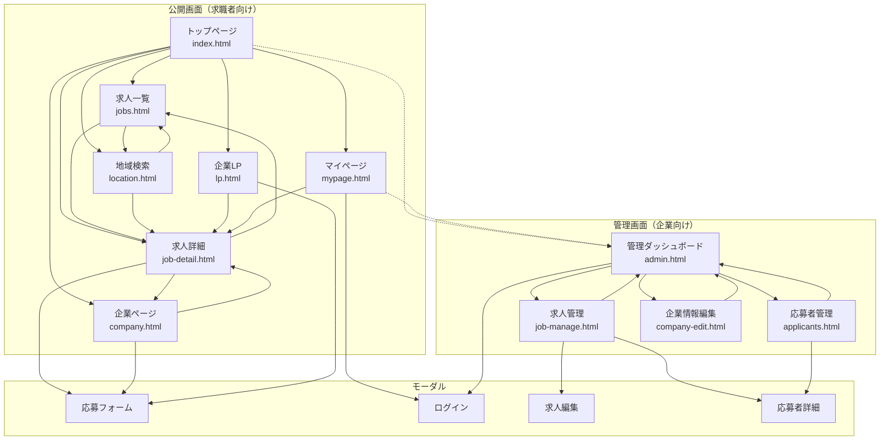
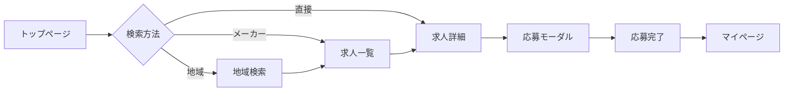
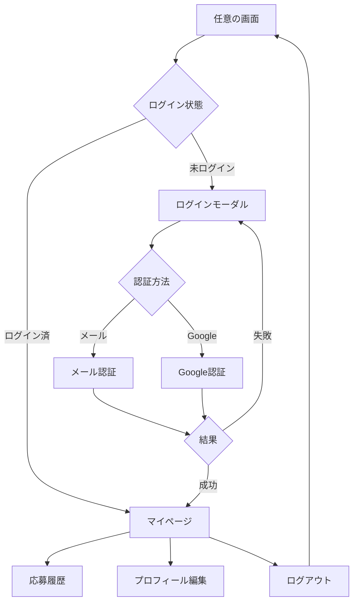
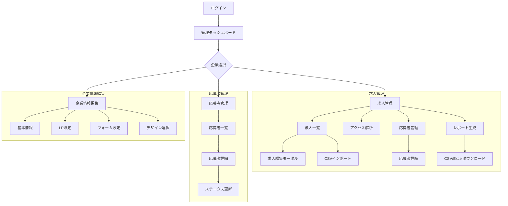
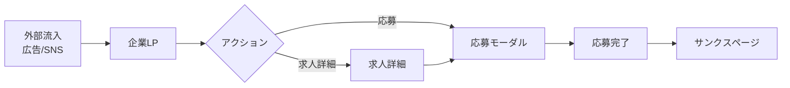
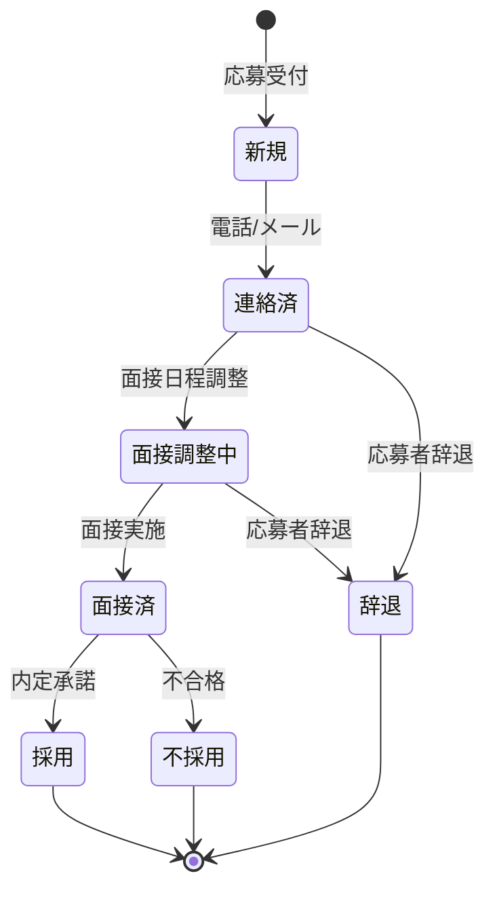
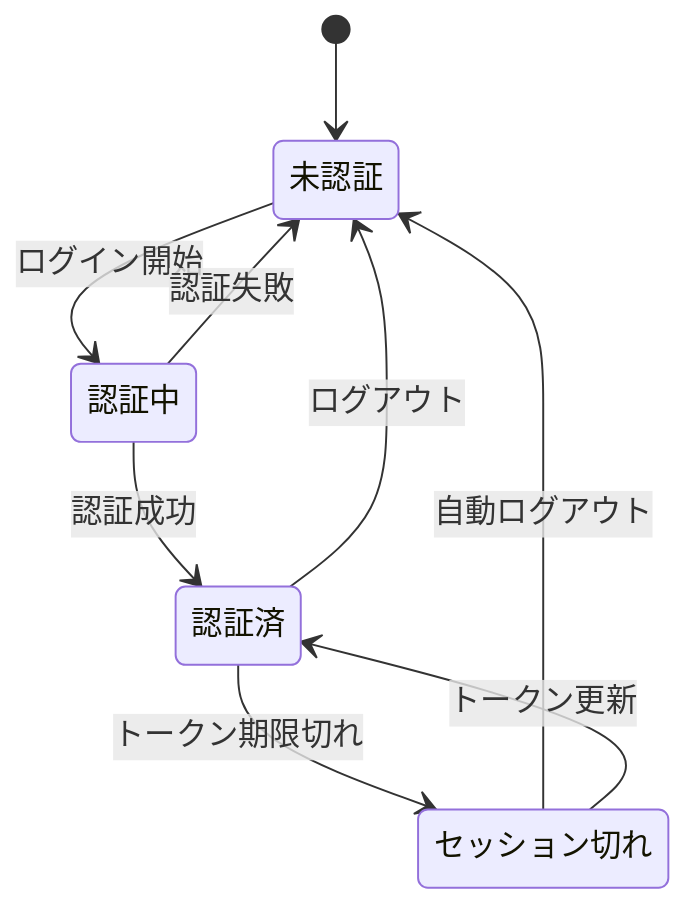

# リクエコ求人ナビ 画面遷移図

## 全体遷移図（Mermaid形式）



---

## 画面遷移マトリクス

### 公開画面間の遷移

| 遷移元 → | TOP | JOBS | DETAIL | COMPANY | LOCATION | LP | MYPAGE |
|----------|-----|------|--------|---------|----------|----|----|
| **TOP** | - | ○ | ○ | ○ | ○ | ○ | ○ |
| **JOBS** | ○ | - | ○ | - | ○ | - | ○ |
| **DETAIL** | ○ | ○ | - | ○ | - | - | ○ |
| **COMPANY** | ○ | - | ○ | - | - | - | ○ |
| **LOCATION** | ○ | ○ | ○ | - | - | - | ○ |
| **LP** | - | - | ○ | - | - | - | - |
| **MYPAGE** | ○ | - | ○ | - | - | - | - |

### 管理画面間の遷移

| 遷移元 → | ADMIN | JOBMNG | APPLICANTS | COMEDIT |
|----------|-------|--------|------------|---------|
| **ADMIN** | - | ○ | ○ | ○ |
| **JOBMNG** | ○ | - | ○ | - |
| **APPLICANTS** | ○ | - | - | - |
| **COMEDIT** | ○ | - | - | - |

---

## 詳細遷移フロー

### 1. 求人検索〜応募フロー



**遷移詳細**:
1. トップページで検索方法を選択
2. 地域/メーカー/入社日で絞り込み
3. 求人カードをクリックして詳細へ
4. 「応募する」ボタンで応募モーダル表示
5. フォーム入力・送信
6. 完了画面表示
7. マイページで応募履歴確認

---

### 2. ユーザー認証フロー



---

### 3. 管理画面フロー



---

### 4. 企業LP経由の応募フロー



---

## URL パラメータ一覧

| 画面 | パラメータ | 説明 | 例 |
|------|-----------|------|-----|
| job-detail.html | company | 企業ドメイン | toyota |
| job-detail.html | job | 求人ID | 1 |
| company.html | id | 企業ドメイン | toyota |
| location.html | pref | 都道府県 | 愛知県 |
| jobs.html | tag | 検索タグ | 寮完備 |
| jobs.html | maker | メーカー絞り込み | トヨタ |
| lp.html | id | 企業ドメイン | toyota |
| job-manage.html | company | 企業ドメイン | toyota |
| company-edit.html | id | 企業ドメイン | toyota |

---

## 状態遷移（ステートマシン）

### 応募ステータス



### ユーザー認証状態



---

## 共通ヘッダーからの遷移

```
┌─────────────────────────────────────────────────────────┐
│ [ロゴ]  求人検索  企業一覧  期間工ガイド  [LINE相談] [ログイン] │
│    ↓       ↓        ↓          ↓           ↓         ↓     │
│   TOP    JOBS    (TOP)      (外部)       LINE    LOGIN/  │
│                                                   MYPAGE  │
└─────────────────────────────────────────────────────────┘
```

---

## エラー・例外遷移

| エラー種別 | 発生画面 | 遷移先 | 処理 |
|-----------|----------|--------|------|
| 404 Not Found | 任意 | エラーページ | トップへのリンク表示 |
| 認証エラー | 管理画面 | ログインモーダル | 再ログイン促す |
| データ読込エラー | 任意 | 同画面 | エラーメッセージ表示・リトライボタン |
| 応募送信エラー | 応募モーダル | 同モーダル | エラーメッセージ表示・再送信可能 |
| 権限エラー | 管理画面 | 管理ダッシュボード | 権限なしメッセージ表示 |

---

*最終更新: 2026-01-26*
