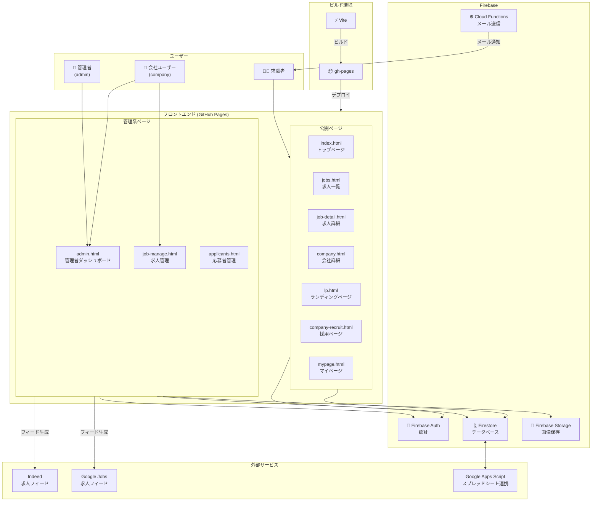
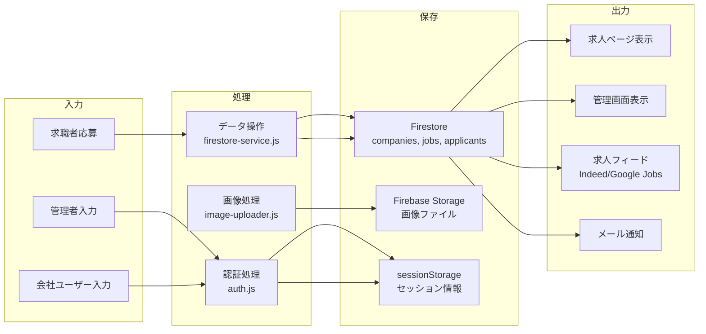
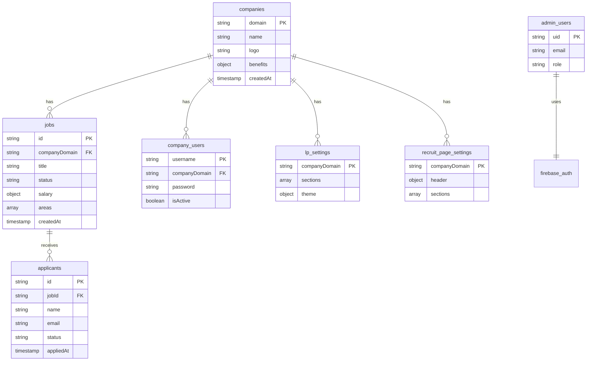

# 管理画面システム構成

## システム構成図



## データフロー図



## Firestoreコレクション構成



## 概要

本システムには2種類のユーザータイプが存在し、それぞれ異なる権限とアクセス範囲を持ちます。

| ユーザータイプ | 説明 | データアクセス範囲 |
|--------------|------|------------------|
| **admin**（管理者） | システム全体を管理 | 全社データ |
| **company**（会社ユーザー） | 自社のデータを管理 | 自社データのみ |

---

## ファイル構成

### HTMLファイル

```
admin.html      ← 管理者・会社ユーザー共通のログイン画面＆ダッシュボード
job-manage.html ← 会社ユーザー向け求人管理画面（管理者も利用可）
```

### エントリーポイント

```
src/pages/
├── admin.js       → admin.html のエントリーポイント
└── job-manage.js  → job-manage.html のエントリーポイント
```

### 機能モジュール

```
src/features/
├── admin/                          [admin.html 用モジュール群]
│   ├── index.js                    メインロジック・初期化
│   ├── auth.js                     認証・権限管理
│   ├── config.js                   設定値
│   ├── admin-state.js              状態管理
│   ├── company-manager.js          会社管理（admin専用）
│   ├── job-listings.js             求人一覧（会社選択→求人編集へ遷移）
│   ├── job-manage-embedded.js      求人編集（埋め込み型）
│   ├── recruit-settings.js         採用ページ設定
│   ├── lp-settings.js              LP設定
│   ├── analytics.js                アナリティクス
│   ├── job-feed-generator.js       Indeed/Google求人フィード生成
│   ├── image-uploader.js           画像アップロード
│   └── company-edit-embedded.js    会社編集（埋め込み型）
│
├── job-manage/                     [job-manage.html 用モジュール群]
│   ├── index.js                    メインロジック・初期化
│   ├── auth.js                     認証・セッション管理
│   ├── state.js                    状態管理
│   ├── jobs.js                     求人CRUD操作
│   ├── analytics.js                アクセス解析
│   ├── reports.js                  レポート生成
│   ├── feeds.js                    求人フィード生成
│   ├── lp-settings.js              LP設定
│   ├── recruit-settings.js         採用ページ設定
│   └── settings.js                 アカウント設定
│
└── applicants/                     [応募者管理（共通）]
    └── index.js                    応募者一覧・詳細
```

---

## 認証の仕組み

### セッション管理

認証状態は `sessionStorage` で管理されます。

```javascript
// キー名と保存値
sessionStorage.setItem('rikueco_admin_session', 'authenticated');
sessionStorage.setItem('rikueco_user_role', 'admin' | 'company');
sessionStorage.setItem('rikueco_user_company', companyDomain);  // company のみ
sessionStorage.setItem('company_user_id', username);            // company のみ
```

### ログイン方法

| 方法 | 対象 | 検証方法 |
|-----|------|---------|
| 会社ユーザーログイン | company | Firestore `company_users` コレクション |
| 管理者ログイン | admin | ハードコード（config.js） |
| Google ログイン | admin | Firebase Auth + Firestore `admin_users` |

### 権限チェック関数

```javascript
// src/features/admin/auth.js & src/features/job-manage/auth.js

checkSession()                  // セッションの存在確認
isAdmin()                       // 管理者かどうか
hasAccessToCompany(domain)      // 特定会社へのアクセス権
getUserRole()                   // ロール取得（'admin' | 'company'）
getUserCompanyDomain()          // 会社ドメイン取得
```

---

## 画面遷移フロー

### admin.html

```
ログイン画面
    │
    ├─ [会社ユーザー] ──→ セッション保存 ──→ ダッシュボード（制限付き）
    │                                         ├─ 求人一覧 ──→ job-manage.html へ遷移
    │                                         ├─ 応募者管理
    │                                         ├─ 採用ページ設定
    │                                         ├─ LP設定
    │                                         └─ 設定（パスワード変更のみ）
    │
    ├─ [管理者] ──→ セッション保存 ──→ ダッシュボード（フルアクセス）
    │                                  ├─ 概要（アナリティクス）
    │                                  ├─ 会社管理
    │                                  │   └─ 会社選択 ──→ 求人管理（埋め込み）
    │                                  ├─ 求人一覧
    │                                  ├─ 採用ページ設定
    │                                  ├─ LP設定
    │                                  ├─ 応募者管理
    │                                  ├─ ユーザー管理
    │                                  └─ 設定
    │
    └─ [Google] ──→ Firebase Auth ──→ admin_users 検証 ──→ 同上
```

### job-manage.html

```
URL: job-manage.html?domain={companyDomain}&company={companyName}
    │
    ├─ セッション確認 ──→ 失敗時 admin.html へリダイレクト
    │
    └─ ダッシュボード
        ├─ 求人一覧（jobs.js）
        │   ├─ 求人カード表示
        │   ├─ 新規作成 / 編集 / 複製 / 削除
        │   └─ フィルタリング（検索、ステータス、エリア）
        ├─ 応募者管理（applicants section）
        ├─ アクセス解析（analytics.js）
        ├─ レポート（reports.js）
        ├─ 採用ページ設定（recruit-settings.js）
        ├─ LP設定（lp-settings.js）
        └─ 設定（settings.js - パスワード変更）
```

---

## ユーザータイプ別機能一覧

### admin（管理者）

| 機能 | admin.html | job-manage.html |
|-----|-----------|----------------|
| 全社アナリティクス | ✅ | - |
| 会社管理（CRUD） | ✅ | - |
| 全社求人一覧 | ✅ | - |
| 特定会社の求人管理 | ✅（埋め込み） | ✅ |
| 採用ページ設定 | ✅ | ✅ |
| LP設定 | ✅ | ✅ |
| 応募者管理 | ✅ | ✅ |
| ユーザー管理 | ✅ | - |
| フィード生成 | ✅ | ✅ |

### company（会社ユーザー）

| 機能 | admin.html | job-manage.html |
|-----|-----------|----------------|
| 自社求人一覧 | ✅（遷移のみ） | ✅（メイン） |
| 自社求人の編集 | - | ✅ |
| 自社採用ページ設定 | ✅ | ✅ |
| 自社LP設定 | ✅ | ✅ |
| 自社応募者管理 | ✅ | ✅ |
| アクセス解析 | ✅（自社のみ） | ✅ |
| パスワード変更 | ✅ | ✅ |

---

## UI切り替えの仕組み

### admin.html でのロールベースUI

```javascript
// src/features/admin/index.js
function applyRoleBasedUI() {
  const navAdmin = document.getElementById('nav-admin');
  const navCompany = document.getElementById('nav-company');

  if (isAdmin()) {
    navAdmin.style.display = 'block';
    navCompany.style.display = 'none';
    switchSection('overview');
  } else {
    navAdmin.style.display = 'none';
    navCompany.style.display = 'block';
    switchSection('job-listings');
    applySettingsRestrictions();  // パスワード変更のみ表示
  }
}
```

### job-manage.html でのロールベースUI

```javascript
// src/features/job-manage/index.js
if (isAdmin()) {
  setupAdminSidebar();  // 管理者用サイドバー表示
} else {
  applyCompanyUserRestrictions();  // 会社ユーザー用制限
}
```

---

## データベース構造（Firestore）

### 認証関連コレクション

```
admin_users
├── uid: string           Firebase UID
├── email: string         メールアドレス
├── role: 'admin'
└── createdAt: timestamp

company_users
├── username: string      ログインID（ユニーク）
├── password: string      パスワード（平文※要改善）
├── companyDomain: string 所属会社ドメイン
├── name: string          表示名
├── isActive: boolean     アクティブ状態
├── createdAt: timestamp
├── lastLogin: timestamp
└── passwordChangedAt: timestamp
```

### 業務データコレクション

```
companies              会社情報
jobs                   求人情報
applicants             応募者情報
lp_settings            LP設定
recruit_page_settings  採用ページ設定
```

---

## 補足：admin.html と job-manage.html の使い分け

| 観点 | admin.html | job-manage.html |
|-----|-----------|----------------|
| 主な用途 | システム全体管理 | 求人・応募者管理 |
| ログイン | ここで行う | admin.html から遷移 |
| 求人編集 | 埋め込み型（job-manage-embedded.js） | セクション型（jobs.js） |
| 対象ユーザー | 管理者メイン | 会社ユーザーメイン |

### なぜ2つの画面があるのか

1. **admin.html** は元々管理者専用として設計
2. **job-manage.html** は会社ユーザー向けに特化した操作性を提供
3. 後から会社ユーザーもadmin.htmlにログインできるよう拡張された
4. 結果として、どちらからでも主要機能にアクセス可能な状態に

---

## セキュリティ考慮事項

| 項目 | 現状 | 推奨 |
|-----|------|-----|
| パスワード保存 | 平文 | bcrypt/scrypt でハッシュ化 |
| 管理者認証 | ハードコード | Firebase Auth に統一 |
| セッション管理 | sessionStorage | HttpOnly Cookie |
| API権限検証 | フロントエンドのみ | Cloud Functions でも検証 |
| Firestore Rules | 未設定 | コレクション単位で制限 |
