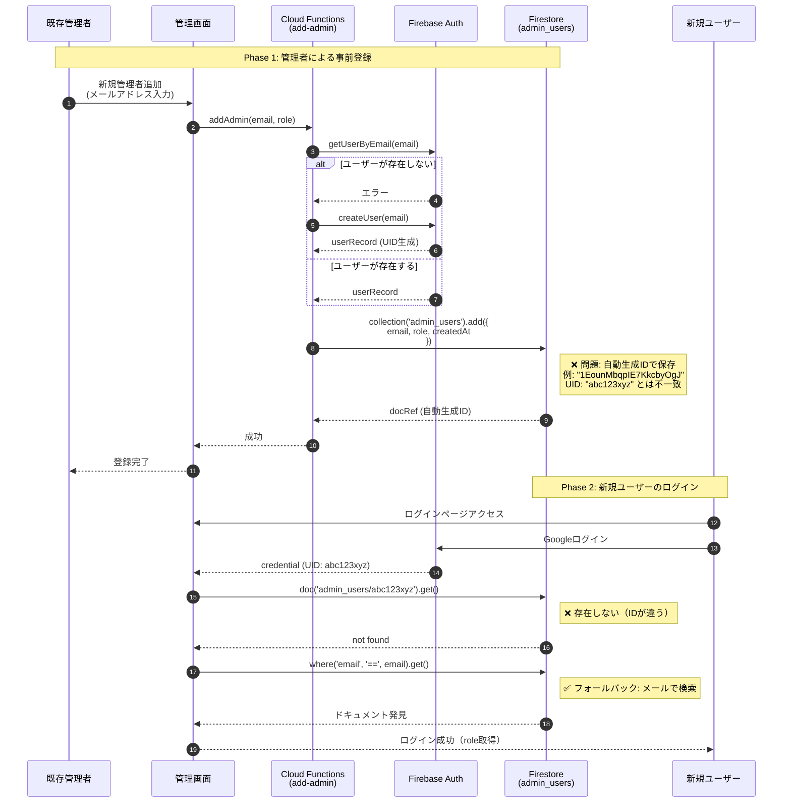
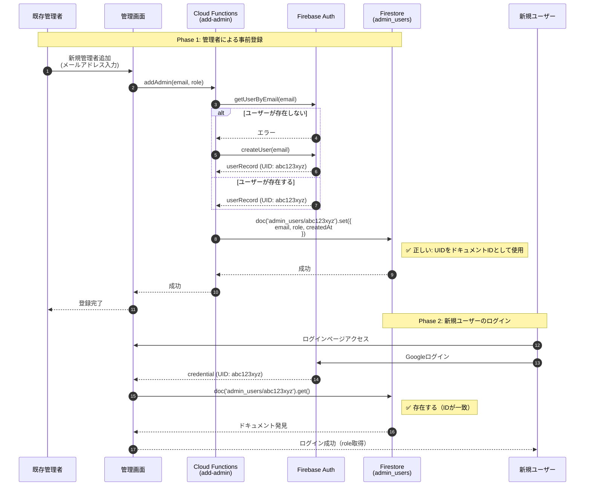
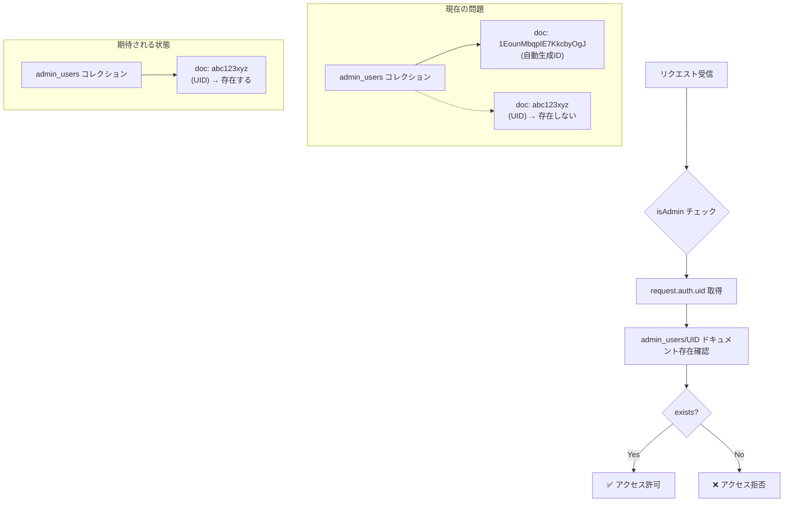

# 管理者ユーザー登録フロー

## 概要

このドキュメントでは、管理者ユーザーの登録・ログインフローについて説明します。
現在の実装には設計上の問題があり、それがなぜ動作しているかも含めて記載します。

## 修正ステータス

> **✅ 修正済み** (2025年2月)
>
> `functions/add-admin.cjs` を修正し、UIDベースでドキュメントを作成するようになりました。
> 既存データの移行スクリプト `scripts/migrate-admin-users-to-uid.cjs` も作成済みです。

---

## 問題の概要（修正前の状態）

### 期待される動作
- `admin_users` コレクションのドキュメントIDは Firebase Auth の UID を使用する
- これにより、Firestore Security Rules で `request.auth.uid` と照合できる

### 修正前の問題
- `functions/add-admin.cjs` が `.add()` を使用しており、自動生成IDでドキュメントが作成されていた
- ドキュメントIDが UID と一致しないため、Security Rules の `isAdmin()` チェックが本来失敗するはずだった

### なぜ動作していたか
- `src/features/admin/auth.js` の `loadUserRole()` 関数にフォールバック機能がある
- UID でのドキュメント取得に失敗した場合、メールアドレスでクエリして権限を取得している

---

## シーケンス図

### 1. 現在の実装（問題あり）



### 2. 期待される実装（修正後）



### 3. Firestore Security Rules の動作



---

## 関連コード

### 修正前のコード（functions/add-admin.cjs）

```javascript
// 修正前の実装（問題あり）
const docRef = await db.collection('admin_users').add({
  email: email,
  role: role || 'company',
  createdAt: admin.firestore.FieldValue.serverTimestamp()
});
// → 自動生成IDが使われていた
```

### 修正後のコード（functions/add-admin.cjs）

```javascript
// 修正後の実装 ✅
// Firebase Auth でユーザーを取得または作成
let userRecord;
try {
  userRecord = await admin.auth().getUserByEmail(email);
} catch (authError) {
  if (authError.code === 'auth/user-not-found') {
    userRecord = await admin.auth().createUser({ email });
  } else {
    throw authError;
  }
}

// UIDをドキュメントIDとして使用
await db.collection('admin_users').doc(userRecord.uid).set({
  email: email,
  role: 'admin',
  createdAt: admin.firestore.FieldValue.serverTimestamp()
});
// → Firebase Auth の UID がドキュメントIDとして使われる
```

### フォールバック機能（src/features/admin/auth.js）

```javascript
async function loadUserRole(uid, email) {
  // 1. まずUIDで検索
  const userDoc = await firebaseDb.collection('admin_users').doc(uid).get();
  if (userDoc.exists) {
    return userDoc.data();
  }

  // 2. フォールバック: メールアドレスで検索
  const emailQuery = await firebaseDb.collection('admin_users')
    .where('email', '==', email)
    .limit(1)
    .get();

  if (!emailQuery.empty) {
    return emailQuery.docs[0].data();
  }

  return null;
}
```

---

## Firestore Security Rules

```javascript
// 管理者かどうかの判定
function isAdmin() {
  return isAuthenticated() &&
    exists(/databases/$(database)/documents/admin_users/$(request.auth.uid));
}
```

この Security Rule は UID ベースでドキュメントの存在を確認するため、
自動生成IDで作成されたドキュメントは検出されません。

---

## 修正内容

### 修正されたファイル
1. `functions/add-admin.cjs` - `.add()` を `.doc(uid).set()` に変更済み

### 既存データの移行

移行スクリプトを作成しました: `scripts/migrate-admin-users-to-uid.cjs`

#### 使用方法

```bash
# 開発環境（dry-run: 何が行われるか確認）
node scripts/migrate-admin-users-to-uid.cjs --dev --dry-run

# 開発環境（実行）
node scripts/migrate-admin-users-to-uid.cjs --dev

# 本番環境（dry-run: 何が行われるか確認）
node scripts/migrate-admin-users-to-uid.cjs --prod --dry-run

# 本番環境（実行）
node scripts/migrate-admin-users-to-uid.cjs --prod
```

#### 移行スクリプトの動作

1. `admin_users` の全ドキュメントを取得
2. 各ドキュメントのメールアドレスから Firebase Auth UID を取得
3. ドキュメントIDがUIDと異なる場合：
   - 新しいUIDベースのドキュメントを作成
   - 古いドキュメントを削除
4. Firebase Auth にユーザーが存在しない場合は自動作成

---

## まとめ

| 項目 | 修正前 | 修正後 |
|------|--------|--------|
| ドキュメントID | 自動生成 | Firebase Auth UID |
| Security Rules | ❌ 機能しない | ✅ 正常動作 |
| ログイン | ✅ フォールバックで動作 | ✅ 直接UID検索で動作 |
| パフォーマンス | やや非効率（クエリ必要） | 効率的（直接参照） |

### 今後の対応

1. **既存データの移行**: `migrate-admin-users-to-uid.cjs` を実行
2. **フォールバック機能**: 当面は `loadUserRole()` のフォールバックを維持（後方互換性）
3. **新規登録**: 修正済みのため、UIDベースで作成される
