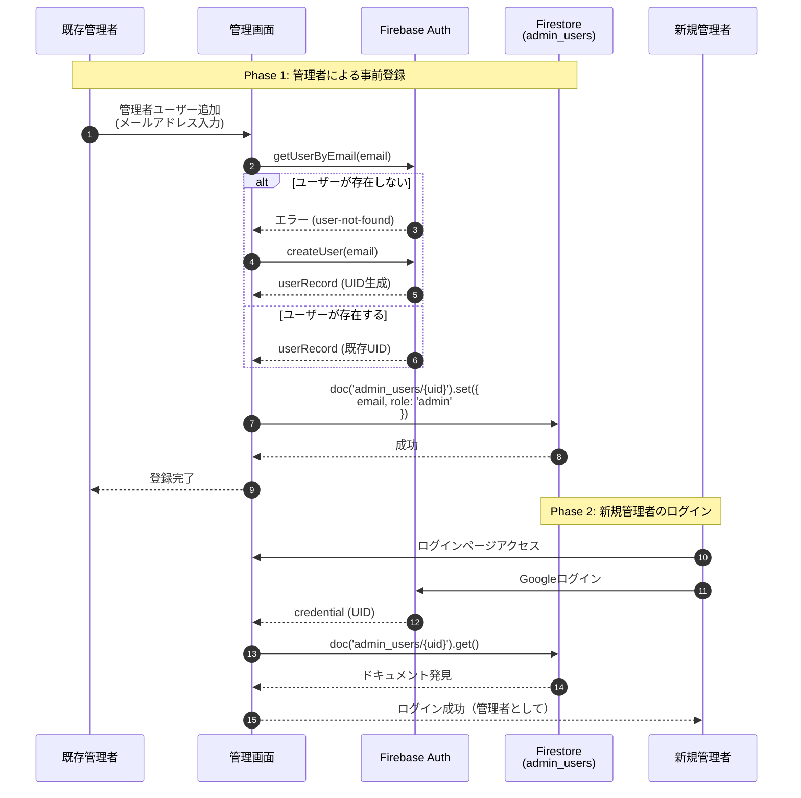
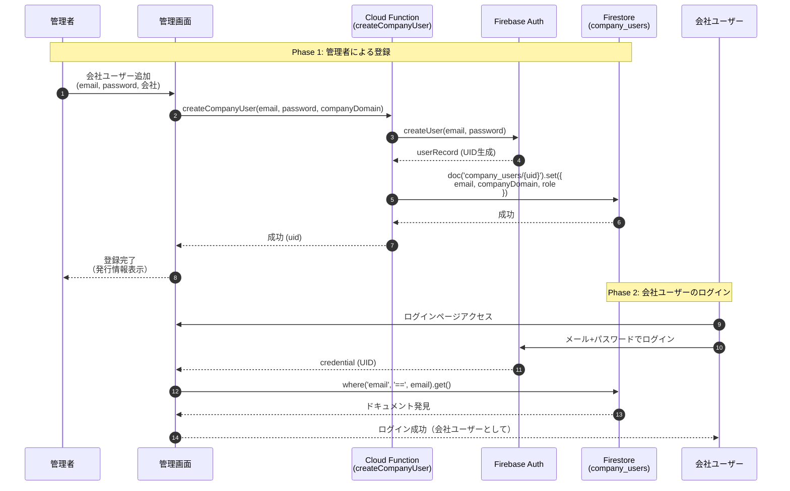
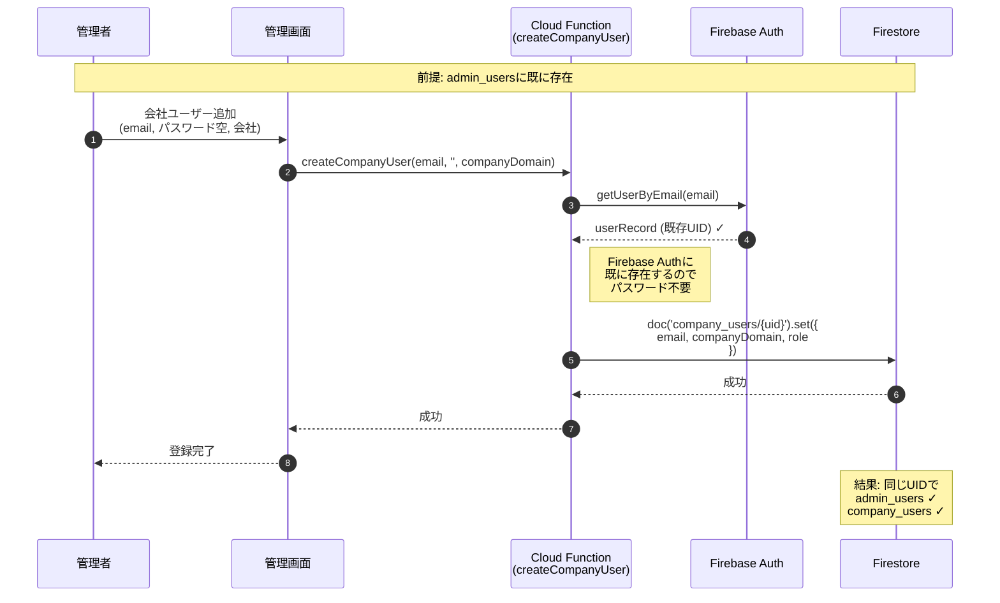
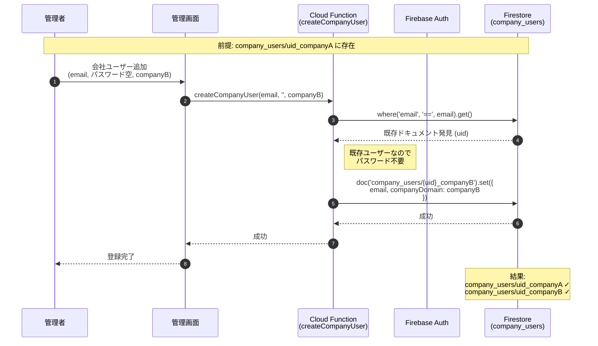
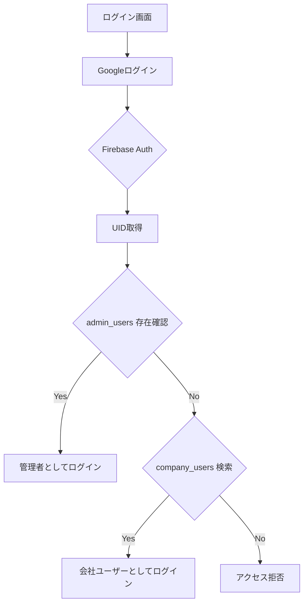
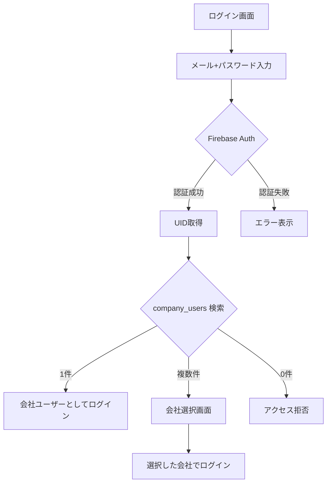

# ユーザー登録・認証フロー

## 概要

このドキュメントでは、管理者ユーザーと会社ユーザーの登録・ログインフローについて説明します。

---

## ユーザータイプ

| タイプ | コレクション | 認証方法 | 権限 |
|--------|--------------|----------|------|
| 管理者ユーザー | `admin_users` | Google認証 | 全会社のデータ閲覧・編集 |
| 会社ユーザー | `company_users` | メール+パスワード | 自社のデータのみ |
| 管理者+会社ユーザー | 両方 | Google認証（共通） | 両方の権限 |

---

## 登録フロー

### ケース1: 管理者ユーザーのみ

管理者が別の管理者を招待するケース。



**ポイント:**
- パスワード不要（Google認証のため）
- ドキュメントIDはFirebase Auth UIDを使用
- 招待後、新規管理者はGoogleアカウントでログイン

---

### ケース2: 会社ユーザーのみ（新規）

管理者が会社ユーザーを新規作成するケース。



**ポイント:**
- パスワード必須（8文字以上）
- Cloud Functionがユーザー作成を担当
- 会社ユーザーはメール+パスワードでログイン

---

### ケース3: 管理者ユーザー → 会社ユーザーに追加

既存の管理者を特定の会社にも所属させるケース。



**ポイント:**
- パスワード不要（Firebase Authに既存ユーザーがあるため）
- 既存のUIDを再利用
- ログイン時はGoogle認証で両方の権限を取得

---

### ケース4: 会社ユーザー → 別会社にも追加

既存の会社ユーザーを別の会社にも所属させるケース（複数会社対応）。



**ポイント:**
- パスワード不要（既存ユーザー）
- ドキュメントIDは `{uid}_{companyDomain}` 形式
- ログイン時に会社選択画面が表示される

---

## ログインフロー

### 管理者ユーザー



### 会社ユーザー



---

## データ構造

### admin_users コレクション

```javascript
// ドキュメントID: Firebase Auth UID
{
  email: "admin@example.com",
  role: "admin",           // 常に "admin"
  createdAt: Timestamp,
  createdBy: "uid"         // 作成した管理者のUID
}
```

### company_users コレクション

```javascript
// ドキュメントID: {uid} または {uid}_{companyDomain}
{
  uid: "abc123xyz",
  email: "user@example.com",
  companyDomain: "company-a",
  companyName: "株式会社A",
  name: "山田太郎",
  username: "yamada",
  role: "manager",         // "manager" | "staff"
  isActive: true,
  createdAt: Timestamp
}
```

---

## Firestore Security Rules

```javascript
// 管理者かどうかの判定
function isAdmin() {
  return isAuthenticated() &&
    exists(/databases/$(database)/documents/admin_users/$(request.auth.uid));
}

// 会社ユーザーかどうかの判定
function isCompanyUser() {
  return isAuthenticated() &&
    exists(/databases/$(database)/documents/company_users/$(request.auth.uid));
}

// 特定の会社に所属しているかの判定
function isCompanyMember(companyDomain) {
  return isAuthenticated() && (
    isAdmin() ||
    exists(/databases/$(database)/documents/company_users/$(request.auth.uid)) ||
    exists(/databases/$(database)/documents/company_users/$(request.auth.uid + '_' + companyDomain))
  );
}
```

---

## まとめ

| ケース | admin_users | company_users | Firebase Auth | パスワード |
|--------|-------------|---------------|---------------|------------|
| 管理者のみ | ✓ | - | Google認証 | 不要 |
| 会社ユーザーのみ（新規） | - | ✓ | Email+PW | **必須** |
| 管理者→会社ユーザー追加 | ✓ | ✓ | 既存流用 | 不要 |
| 会社ユーザー→別会社追加 | - | ✓✓ | 既存流用 | 不要 |

### 重要なポイント

1. **既存ユーザーの招待はパスワード不要**: Firebase Authに既に存在するユーザーを別の会社に追加する場合、パスワードは不要
2. **UIDの共有**: 同じメールアドレスのユーザーは同じUIDを共有し、複数のコレクションに存在可能
3. **複数会社対応**: 会社ユーザーは複数の会社に所属可能（ドキュメントIDで区別）
4. **認証方法の違い**: 管理者はGoogle認証、会社ユーザーはメール+パスワード

---

## 関連ファイル

| ファイル | 説明 |
|----------|------|
| `src/features/admin/auth.js` | 認証ロジック、`addCompanyUser()` |
| `src/features/admin/index.js` | 管理画面UI、`saveCompanyUser()` |
| `functions/index.js` | Cloud Function `createCompanyUser` |
| `firestore.rules` | セキュリティルール |
