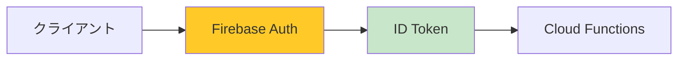
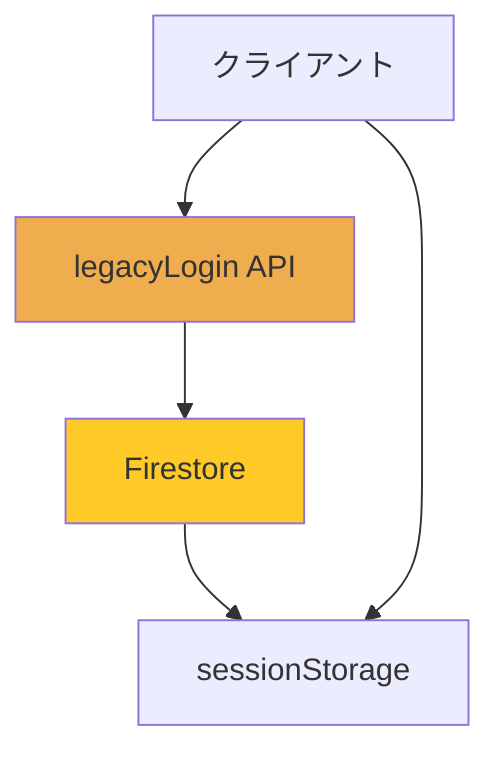
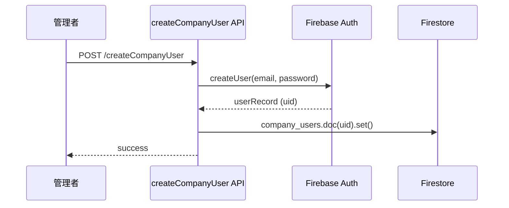
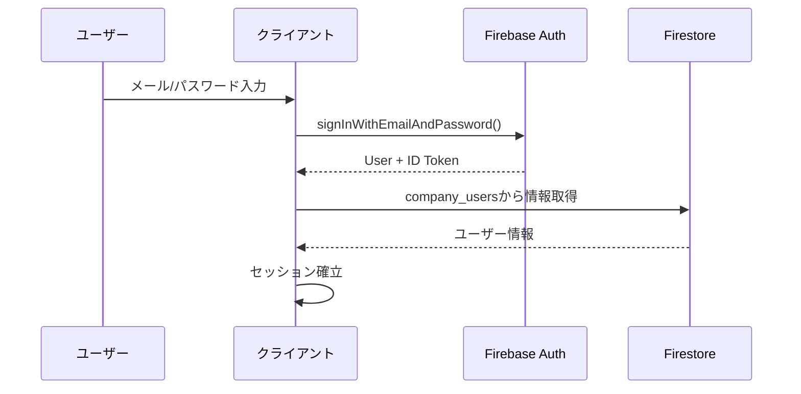
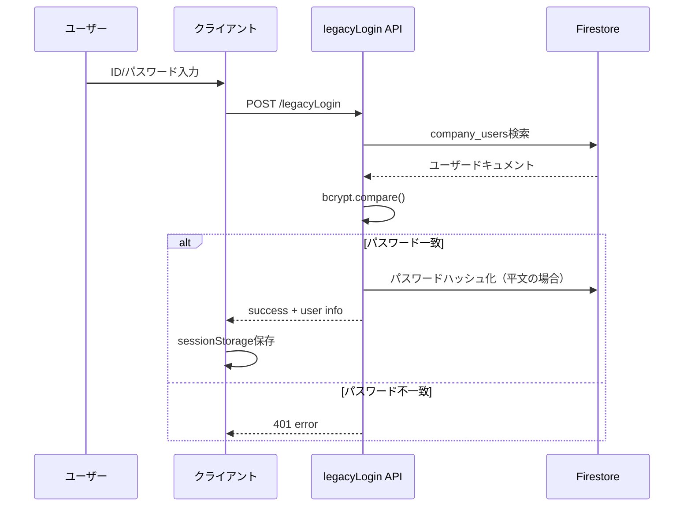

# 認証・認可設計書

## 概要

本システムは2つの認証方式をサポートし、段階的にFirebase Authへ移行中。

---

*最終更新: 2026-02-14*

---

## 認証方式

### 1. Firebase Authentication（推奨・新規ユーザー）



**対応プロバイダ:**
- メール/パスワード認証
- Google認証

**フロー:**
1. クライアントでFirebase Auth SDK使用
2. ログイン成功後、ID Tokenを取得
3. API呼び出し時にAuthorizationヘッダーに設定
4. Cloud FunctionsでID Tokenを検証

### 2. レガシー認証（既存ユーザー・移行中）



**フロー:**
1. ユーザーID/パスワードを入力
2. legacyLogin APIでFirestoreのcompany_usersを検索
3. パスワード検証（bcryptハッシュ）
4. ログイン成功時、平文パスワードは自動でハッシュ化（マイグレーション）
5. セッション情報をsessionStorageに保存

---

## ユーザーロール

### ロール一覧

| ロール | 説明 | 権限 |
|--------|------|------|
| `super_admin` | システム管理者 | 全機能アクセス、全会社データ閲覧 |
| `admin` | 会社管理者 | 自社の全機能アクセス、ユーザー管理 |
| `staff` | 担当者 | 自社データの閲覧・編集 |

### 権限マトリクス

| 機能 | super_admin | admin | staff |
|------|-------------|-------|-------|
| 会社一覧閲覧 | ○ | × | × |
| 会社ビューモード | ○ | × | × |
| ユーザー作成・削除 | ○ | ○ | × |
| 求人管理 | ○ | ○ | ○ |
| 応募者管理 | ○ | ○ | ○ |
| アナリティクス閲覧 | ○ | ○ | ○ |
| 会社設定変更 | ○ | ○ | × |
| LPカスタマイズ | ○ | ○ | ○ |

---

## 認証状態管理

### Firebase Auth ユーザー

```javascript
// auth-service.js
firebase.auth().onAuthStateChanged((user) => {
  if (user) {
    // ログイン済み
    // Firestoreからユーザー情報を取得
    ensureUserDocument(user);
  } else {
    // 未ログイン
  }
});
```

### レガシーユーザー

```javascript
// sessionStorageに保存される情報
{
  company_user_id: "user_doc_id",
  company_user_role: "admin",
  company_user_domain: "example-company",
  available_companies: [...] // 複数会社所属時
}
```

---

## Firestoreデータ構造

### company_users コレクション

```javascript
{
  uid: "firebase_uid",           // Firebase Auth UID（Firebase Authユーザーのみ）
  email: "user@example.com",
  username: "user123",
  password: "$2b$10$...",        // bcryptハッシュ（レガシーのみ）
  companyDomain: "example-company",
  companyName: "株式会社サンプル",
  name: "山田太郎",
  role: "admin",                 // admin | staff
  isActive: true,
  createdAt: Timestamp,
  lastLogin: Timestamp,
  _legacyAuth: true,             // レガシー認証フラグ（移行後削除）
  passwordMigratedAt: Timestamp  // パスワードハッシュ化日時
}
```

### admins コレクション（super_admin用）

```javascript
{
  email: "admin@rikueco.jp",
  createdAt: Timestamp
}
```

---

## 認証フロー詳細

### 新規ユーザー登録



### Firebase Authログイン



### レガシーログイン



---

## セキュリティ対策

### 実装済み

- [x] パスワードのbcryptハッシュ化
- [x] レガシーパスワードの自動マイグレーション
- [x] CORS制限
- [x] XSS対策（escapeHtml）

### 今後の対策

- [ ] sessionStorage → メモリ保持に変更
- [ ] Cloud Functions認証強化（ID Token必須化）
- [ ] Firestoreセキュリティルール強化
- [ ] Rate Limiting導入

---

## 移行計画

### Phase 1（現在）
- 新規ユーザー: Firebase Auth
- 既存ユーザー: レガシー認証（自動ハッシュ化）

### Phase 2
- レガシーユーザーにFirebase Auth移行を促す
- `migrateCompanyUsersToFirebaseAuth` APIで一括移行

### Phase 3
- レガシー認証の廃止
- legacyLogin APIの削除
