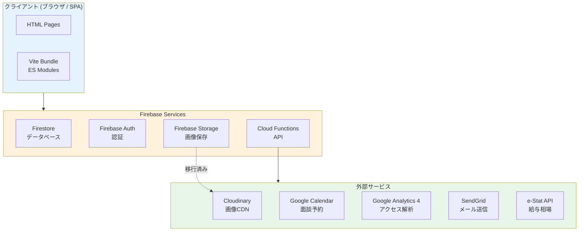
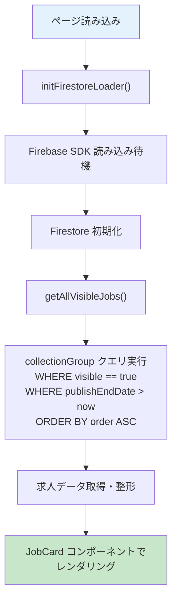
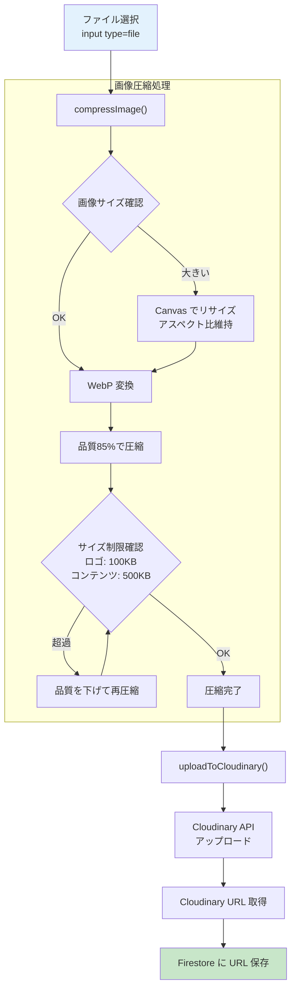
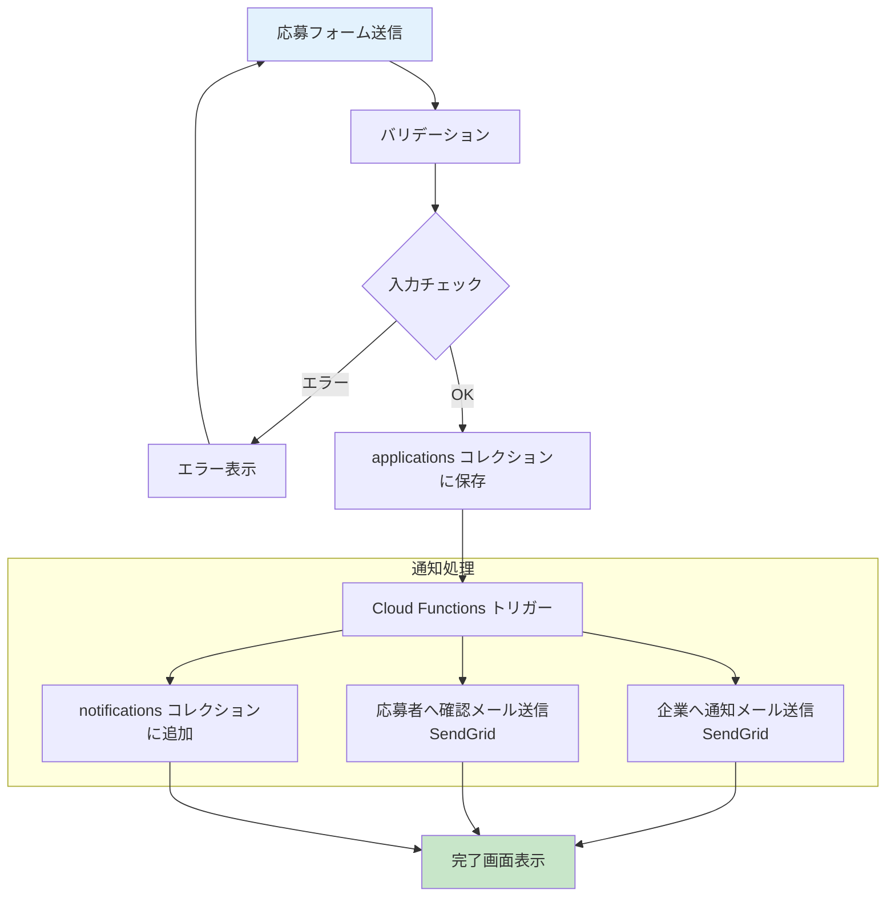
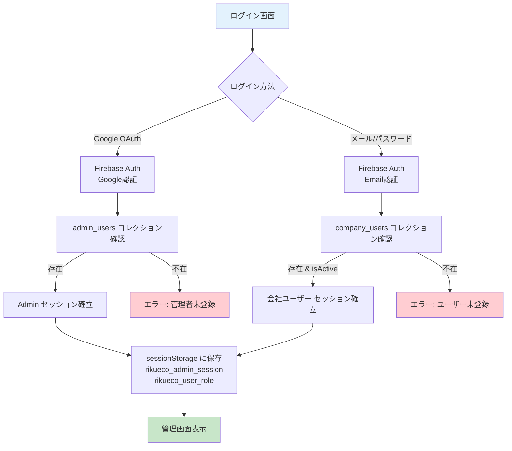
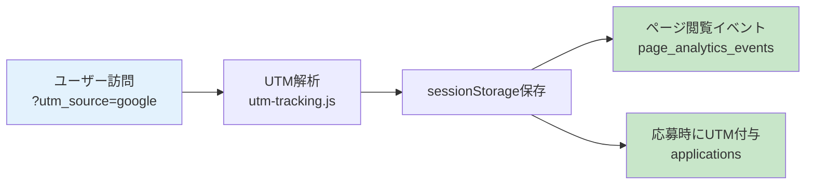

# 詳細設計書

## 概要
リクエコ（求人情報サイト）の詳細設計書です。

*最終更新: 2026-02-14*

---

## システム構成

### アーキテクチャ概要



### 技術スタック

| レイヤー | 技術 |
|---------|------|
| フロントエンド | Vanilla JavaScript (ES Modules) |
| ビルドツール | Vite |
| データベース | Cloud Firestore |
| 認証 | Firebase Authentication |
| サーバーレス関数 | Cloud Functions (Gen1/Gen2) |
| 画像ホスティング | Cloudinary |
| ホスティング | GitHub Pages |

---

## モジュール構成

### コンポーネント層 (`src/components/`)

#### Atoms（最小コンポーネント）
```javascript
// src/components/atoms/index.js
Badge({ text, type })           // バッジ表示
Button({ text, href, className }) // ボタン
LoadingSpinner({ message })     // ローディング
ErrorMessage({ message })       // エラー表示
Image({ src, alt, fallback })   // 画像（フォールバック対応）
TagList({ tags, className })    // タグリスト
Icons                           // SVGアイコン集
```

#### Molecules（複合コンポーネント）
```javascript
// src/components/molecules/index.js
JobCard({ job, showCompanyName, linkToJobsList }) // 求人カード
CompanyJobCard({ job })         // 会社ページ用求人カード
LocationCard({ location })      // 勤務地カード
PointCard({ number, label, value }) // ポイントカード
DetailRow({ label, value })     // 詳細テーブル行
FAQItem({ question, answer })   // FAQアイテム
Modal({ className, title, content }) // モーダル
Breadcrumb({ items })           // パンくずリスト
```

### 機能モジュール層 (`src/features/`)

#### 管理機能 (`admin/`)
| ファイル | 機能 |
|---------|------|
| index.js | 管理画面エントリーポイント |
| auth.js | 管理者認証処理（Firebase Auth対応） |
| admin-state.js | 管理画面状態管理 |
| section-loader.js | セクション動的読み込み |
| company-manager.js | 会社CRUD操作 |
| job-manage-embedded.js | 求人編集（埋め込み版） |
| job-listings.js | 全社求人一覧（フィルタ・メモ機能） |
| lp-settings.js | LP設定管理 |
| lp-section-manager.js | LPセクション管理（ドラッグ&ドロップ） |
| recruit-settings.js | 採用ページ設定管理 |
| image-uploader.js | 画像アップロード・圧縮 |
| analytics.js | アナリティクス表示（GA4 + 独自） |
| announcements.js | お知らせ管理 |

#### LP機能 (`lp/`)
| ファイル | 機能 |
|---------|------|
| index.js | LPページエントリーポイント |
| LPRenderer.js | LP表示レンダラー |
| LPEditor.js | LPエディター |
| sectionTypes.js | セクションタイプ定義 |

#### 認証機能 (`user-auth/`)
| ファイル | 機能 |
|---------|------|
| index.js | 認証エントリーポイント |
| auth-service.js | 認証サービス |
| auth-modal.js | 認証モーダルUI |
| auth-state.js | 認証状態管理 |

### 共通モジュール層 (`src/shared/`)

| ファイル | 機能 |
|---------|------|
| firestore-service.js | Firestore CRUD操作 |
| jobs-loader.js | 求人データローダー |
| job-service.js | 求人サービス（応募処理等） |
| email-service.js | メール送信サービス |
| modal.js | 共通モーダル機能 |
| utils.js | 汎用ユーティリティ |
| layout.js | レイアウト共通処理 |
| auth-gate.js | 認証ゲート |
| page-analytics.js | ページアナリティクス |
| analytics-utils.js | アナリティクスユーティリティ |
| loading.js | ローディング表示管理 |
| validation.js | バリデーション |
| auto-save.js | 自動保存機能 |
| form-ux.js | フォームUX改善 |
| keyboard-shortcuts.js | キーボードショートカット |
| env-config.js | 環境設定 |
| utm-tracking.js | UTMパラメータ追跡 |

---

## データフロー

### 求人データの読み込み



### 画像アップロードフロー



### 応募処理フロー



### 認証フロー



---

## 画像処理

### 圧縮設定

| 用途 | 最大幅 | 最大高 | 品質 | サイズ上限 |
|------|--------|--------|------|-----------|
| ロゴ | 800px | 800px | 85% | 100KB |
| コンテンツ画像 | 1200px | 1200px | 85% | 500KB |
| ヒーロー画像 | 1920px | 1920px | 85% | 500KB |

### デフォルト画像

| 種類 | パス |
|------|------|
| 会社ロゴ | /images/default-company-logo.webp |
| 求人ロゴ | /images/default-job-logo.webp |

---

## LP セクション構成

### 利用可能なセクションタイプ

| タイプ | 説明 |
|--------|------|
| hero | ヒーローセクション（メインビジュアル） |
| point | ポイントセクション（特徴紹介） |
| detail | 詳細セクション（求人詳細情報） |
| faq | FAQセクション |
| cta | CTAセクション（応募促進） |
| gallery | ギャラリーセクション |
| video | 動画セクション |
| testimonial | 社員の声セクション |

### デザインパターン

| パターン名 | 特徴 |
|-----------|------|
| shinrai | 信頼感のあるデザイン |
| athome | アットホームなデザイン |
| cute | かわいらしいデザイン |
| modan | モダンなデザイン |
| kenchiku | 建築系デザイン |

---

## セキュリティ

### 認証方式

| 対象 | 認証方式 | 保存先 |
|------|----------|--------|
| 管理者 | Google OAuth | admin_users |
| 会社ユーザー | Firebase Auth（Email/PW） | company_users |
| 一般ユーザー | Google OAuth / Email | users |

### Firestore セキュリティルール

詳細は [Firestore DB構成図](./firestore-schema.md) を参照。

```javascript
// 公開データ
companies: read=true, write=auth
jobs: read=true (visible && publishEndDate > now), write=auth
lpSettings: read=true, write=auth
recruitSettings: read=true, write=auth

// 認証必要
admin_users: read=auth, write=admin
company_users: read=auth, write=admin
applications: read=自社のみ, write=auth
messages: read=当事者のみ, write=当事者のみ
notifications: read=自社のみ, write=system
```

---

## エラーハンドリング

### 画像読み込みエラー

```javascript
// Image コンポーネントの onerror 処理
if (this.src !== fallback) {
  this.src = fallback;  // フォールバック画像に切り替え
} else {
  this.style.display = 'none';  // フォールバックも失敗時は非表示
}
```

### Firestore エラー

```javascript
try {
  const result = await firestoreOperation();
  return { success: true, data: result };
} catch (error) {
  console.error('[Service] Error:', error);
  return { success: false, error: error.message };
}
```

### Cloud Functions エラー

```javascript
// エラーレスポンス形式
{
  success: false,
  error: {
    code: 'VALIDATION_ERROR',
    message: 'エラーメッセージ'
  }
}
```

---

## パフォーマンス最適化

### 画像最適化
- WebP形式で保存
- 用途に応じたサイズ制限
- Cloudinary CDN使用
- 遅延読み込み（loading="lazy"）

### データ取得最適化
- collectionGroup クエリでの一括取得
- Firestore インデックス活用
- 必要なフィールドのみ取得
- キャッシュ活用（sessionStorage）

### ビルド最適化
- Vite によるバンドル
- Terser による圧縮
- コード分割
- Tree Shaking

---

## UTMトラッキング

### サポートパラメータ

| パラメータ | 用途 | 例 |
|-----------|------|-----|
| utm_source | 流入元 | `google`, `indeed`, `line` |
| utm_medium | メディア種別 | `cpc`, `organic`, `referral` |
| utm_campaign | キャンペーン名 | `spring_campaign` |
| utm_content | コンテンツ識別 | `banner_a` |
| utm_term | キーワード | `東京 求人` |

### トラッキングフロー



---

## 関連ドキュメント
- [Firestore DB構成図](./firestore-schema.md)
- [インフラ構成図](./infrastructure.md)
- [管理画面システム構成](./admin-system-architecture.md)
- [画面遷移図](../ui/screen-flow.md)
- [API仕様書](./api-specification.md)
