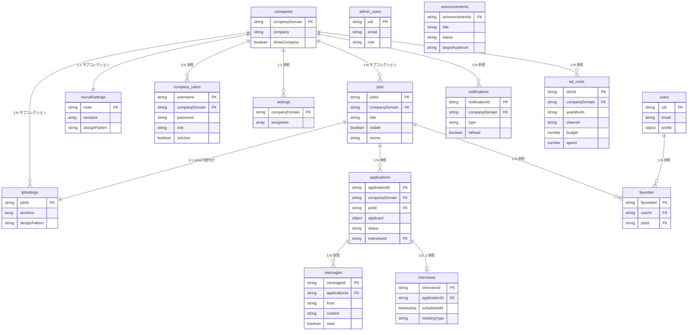

# Firestore DB構成図

## 概要
リクエコで使用するCloud Firestoreのデータベース構成を記述します。

---

## コレクション構成図

```
firestore/
│
├── companies/                    # 会社情報
│   └── {companyDomain}/          # ドキュメントID = 会社ドメイン
│       ├── jobs/                 # サブコレクション: 求人
│       │   └── {jobId}/
│       ├── lpSettings/           # サブコレクション: LP設定
│       │   └── {jobId}/
│       └── recruitSettings/      # サブコレクション: 採用ページ設定
│           └── main/
│
├── admin_users/                  # 管理者ユーザー
│   └── {uid}/
│
├── company_users/                # 会社ユーザー
│   └── {username}/
│
├── applications/                 # 応募データ
│   └── {applicationId}/
│
├── users/                        # 一般ユーザー
│   └── {uid}/
│
├── settings/                     # 設定（担当者リスト等）
│   └── {companyDomain}/
│
├── messages/                     # メッセージ（応募者↔会社）
│   └── {messageId}/
│
├── notifications/                # 通知（会社ユーザー向け）
│   └── {notificationId}/
│
├── announcements/                # お知らせ（管理者配信）
│   └── {announcementId}/
│
├── interviews/                   # 面談スケジュール
│   └── {interviewId}/
│
├── favorites/                    # お気に入り求人
│   └── {favoriteId}/
│
├── page_analytics_events/        # アナリティクスイベント
│   └── {docId}/
│
├── admin_activity/               # 管理画面利用ログ
│   └── {docId}/
│
└── ad_costs/                     # 広告費用データ
    └── {docId}/
```

---

## コレクション詳細

### companies（会社情報）

```typescript
// /companies/{companyDomain}
{
  company: string,           // 会社名
  companyAddress: string,    // 住所
  description: string,       // 会社説明（HTML可）
  imageUrl: string,          // 会社ロゴURL
  logoUrl: string,           // 会社ロゴURL（別名）
  designPattern: string,     // デザインパターン
  order: number,             // 表示順
  showCompany: boolean,      // 公開フラグ
  createdAt: Timestamp,
  updatedAt: Timestamp
}
```

### companies/{companyDomain}/jobs（求人情報）

```typescript
// /companies/{companyDomain}/jobs/{jobId}
{
  id: string,                 // 求人ID
  title: string,              // 募集タイトル
  location: string,           // 勤務地
  companyAddress: string,     // 会社住所
  access: string,             // アクセス情報

  // 給与情報
  salaryType: string,         // 給与形態（時給/日給/月給）
  monthlySalary: string,      // 月給
  monthlySalaryExample: string, // 月収例
  dailySalaryExample: string,   // 日収例
  yearlySalaryExample: string,  // 年収例
  totalBonus: string,         // 特典総額

  // 求人詳細
  jobType: string,            // 職種
  jobDescription: string,     // 仕事内容
  requirements: string,       // 応募資格
  benefits: string,           // 福利厚生
  workingHours: string,       // 勤務時間
  holidays: string,           // 休日
  employmentType: string,     // 雇用形態

  // 表示設定
  features: string,           // 特徴タグ（カンマ区切り）
  displayedFeatures: string,  // 表示用特徴タグ
  visible: boolean,           // 公開フラグ
  order: number,              // 表示順
  memo: string,               // 管理用メモ

  // 掲載期間
  publishStartDate: Timestamp,
  publishEndDate: Timestamp,

  // メディア
  jobLogo: string,            // 求人ロゴURL
  showVideoButton: boolean,   // 動画ボタン表示
  videoUrl: string,           // 動画URL

  createdAt: Timestamp,
  updatedAt: Timestamp
}
```

### companies/{companyDomain}/lpSettings（LP設定）

```typescript
// /companies/{companyDomain}/lpSettings/{jobId}
{
  sections: [                 // セクション配列
    {
      type: string,           // セクションタイプ
      visible: boolean,       // 表示フラグ
      order: number,          // 表示順
      settings: {             // セクション固有設定
        title: string,
        subtitle: string,
        // ... セクションタイプに応じた設定
      }
    }
  ],
  designPattern: string,      // デザインパターン
  themeColor: string,         // テーマカラー
  updatedAt: Timestamp
}
```

### companies/{companyDomain}/recruitSettings（採用ページ設定）

```typescript
// /companies/{companyDomain}/recruitSettings/main
{
  sections: [                 // セクション配列
    {
      type: string,
      visible: boolean,
      order: number,
      settings: { ... }
    }
  ],
  headerSettings: {
    logoUrl: string,
    heroImageUrl: string,
    title: string,
    subtitle: string
  },
  footerSettings: {
    companyName: string,
    address: string,
    phone: string,
    email: string
  },
  designPattern: string,
  updatedAt: Timestamp
}
```

### admin_users（管理者ユーザー）

```typescript
// /admin_users/{uid}
{
  uid: string,
  email: string,
  displayName: string,
  photoURL: string,
  role: string,               // 'admin' | 'super_admin'
  createdAt: Timestamp,
  lastLoginAt: Timestamp
}
```

### company_users（会社ユーザー）

```typescript
// /company_users/{username}
{
  username: string,
  password: string,           // ハッシュ化推奨
  companyDomain: string,      // 紐付け会社
  displayName: string,
  email: string,
  role: string,               // 'company_admin' | 'company_user'
  isActive: boolean,          // アクティブフラグ
  createdAt: Timestamp,
  lastLoginAt: Timestamp
}
```

### applications（応募データ）

```typescript
// /applications/{applicationId}
{
  // 応募者情報
  applicant: {
    name: string,
    email: string,
    phone: string,
    age: number,
    currentJob: string,
    experience: string,
    message: string
  },

  // 求人情報
  companyDomain: string,
  companyName: string,        // 会社名（表示用）
  jobId: string,
  jobTitle: string,

  // ステータス
  status: string,             // 'new' | 'reviewing' | 'interview' | 'hired' | 'rejected'

  // 面談情報
  interviewId: string,        // 面談スケジュールへの参照
  interviewDate: Timestamp,
  interviewNotes: string,

  // 担当者
  assignee: string,           // 担当者名

  createdAt: Timestamp,
  updatedAt: Timestamp
}
```

### users（一般ユーザー）

```typescript
// /users/{uid}
{
  uid: string,
  email: string,
  displayName: string,
  photoURL: string,

  // プロフィール
  profile: {
    name: string,
    phone: string,
    age: number,
    currentJob: string,
    desiredJob: string,
    experience: string
  },

  createdAt: Timestamp,
  updatedAt: Timestamp
}
```

### settings（設定）

```typescript
// /settings/{companyDomain}
{
  assignees: string[],        // 担当者リスト
  updatedAt: Timestamp
}
```

### messages（メッセージ）

```typescript
// /messages/{messageId}
{
  applicationId: string,      // 紐付け応募ID
  companyDomain: string,
  from: string,               // 'company' | 'applicant'
  content: string,            // メッセージ内容
  read: boolean,              // 既読フラグ
  createdAt: Timestamp
}
```

### notifications（通知）

```typescript
// /notifications/{notificationId}
{
  type: string,               // 'application' | 'message' | 'system'
  companyDomain: string,
  applicationId: string,
  jobId: string,
  jobTitle: string,
  applicantName: string,
  applicantEmail: string,
  isRead: boolean,
  createdAt: Timestamp
}
```

### announcements（お知らせ）

```typescript
// /announcements/{announcementId}
{
  title: string,
  content: string,
  targetAudience: string,     // 'job_seekers' | 'company_users' | 'all'
  publishStartDate: Timestamp,
  publishEndDate: Timestamp,
  status: string,             // 'draft' | 'published'
  priority: number,
  createdBy: string,
  createdAt: Timestamp,
  updatedAt: Timestamp
}
```

### interviews（面談スケジュール）

```typescript
// /interviews/{interviewId}
{
  applicationId: string,      // 紐付け応募ID
  companyDomain: string,
  scheduledAt: Timestamp,     // 面談日時
  staffName: string,          // 担当スタッフ
  meetingType: string,        // 'in_person' | 'online' | 'phone'
  location: string,           // 面談場所（対面の場合）
  meetingUrl: string,         // 会議URL（オンラインの場合）
  notes: string,              // メモ
  createdAt: Timestamp,
  updatedAt: Timestamp
}
```

### favorites（お気に入り）

```typescript
// /favorites/{favoriteId}
{
  userId: string,             // ユーザーID
  jobId: string,              // 求人ID
  jobTitle: string,
  companyDomain: string,
  companyName: string,
  location: string,
  monthlySalary: string,
  createdAt: Timestamp
}
```

### page_analytics_events（アナリティクスイベント）

```typescript
// /page_analytics_events/{docId}
{
  pageType: string,           // 'lp' | 'recruit' | 'job'
  companyDomain: string,
  jobId: string,
  eventType: string,          // 'pageview' | 'apply_click' | 'scroll'
  userAgent: string,
  referrer: string,
  createdAt: Timestamp
}
```

### admin_activity（管理画面利用ログ）

```typescript
// /admin_activity/{docId}
{
  userId: string,             // ユーザーID
  userType: string,           // 'admin' | 'company'
  action: string,             // 操作内容
  section: string,            // セクション名
  details: object,            // 詳細情報
  createdAt: Timestamp
}
```

### ad_costs（広告費用データ）

```typescript
// /ad_costs/{docId}
{
  companyDomain: string,      // 対象会社ドメイン
  yearMonth: string,          // 対象年月（"2026-02"形式）
  channel: string,            // 広告チャンネル（'google' | 'tiktok' | 'x' | 'meta' | 'yahoo' | 'line'）
  budget: number,             // 予算（円）
  spend: number,              // 実績費用（円）
  createdBy: string,          // 作成者（'admin'等）
  createdAt: Timestamp,
  updatedAt: Timestamp
}
```

---

## インデックス設定

### jobs コレクション

```json
{
  "collectionGroup": "jobs",
  "queryScope": "COLLECTION",
  "fields": [
    { "fieldPath": "visible", "order": "ASCENDING" },
    { "fieldPath": "order", "order": "ASCENDING" }
  ]
}
```

```json
{
  "collectionGroup": "jobs",
  "queryScope": "COLLECTION_GROUP",
  "fields": [
    { "fieldPath": "visible", "order": "ASCENDING" },
    { "fieldPath": "publishEndDate", "order": "DESCENDING" }
  ]
}
```

### applications コレクション

```json
{
  "collectionGroup": "applications",
  "queryScope": "COLLECTION",
  "fields": [
    { "fieldPath": "companyDomain", "order": "ASCENDING" },
    { "fieldPath": "createdAt", "order": "DESCENDING" }
  ]
}
```

### messages コレクション

```json
{
  "collectionGroup": "messages",
  "queryScope": "COLLECTION",
  "fields": [
    { "fieldPath": "applicationId", "order": "ASCENDING" },
    { "fieldPath": "createdAt", "order": "ASCENDING" }
  ]
}
```

### notifications コレクション

```json
{
  "collectionGroup": "notifications",
  "queryScope": "COLLECTION",
  "fields": [
    { "fieldPath": "companyDomain", "order": "ASCENDING" },
    { "fieldPath": "isRead", "order": "ASCENDING" },
    { "fieldPath": "createdAt", "order": "DESCENDING" }
  ]
}
```

### favorites コレクション

```json
{
  "collectionGroup": "favorites",
  "queryScope": "COLLECTION",
  "fields": [
    { "fieldPath": "userId", "order": "ASCENDING" },
    { "fieldPath": "createdAt", "order": "DESCENDING" }
  ]
}
```

### company_users コレクション

```json
{
  "collectionGroup": "company_users",
  "queryScope": "COLLECTION",
  "fields": [
    { "fieldPath": "companyDomain", "order": "ASCENDING" },
    { "fieldPath": "isActive", "order": "ASCENDING" }
  ]
}
```

---

## セキュリティルール概要

| コレクション | 読み取り | 書き込み |
|-------------|---------|---------|
| companies | 全員 | 認証ユーザー |
| jobs | 全員（visible=true） | 認証ユーザー |
| lpSettings | 全員 | 認証ユーザー |
| recruitSettings | 全員 | 認証ユーザー |
| admin_users | 認証ユーザー | 管理者 |
| company_users | 全員 | 管理者 |
| applications | 自社のみ | 認証ユーザー |
| users | 本人のみ | 本人のみ |
| settings | 自社のみ | 認証ユーザー |
| messages | 当事者のみ | 当事者のみ |
| notifications | 自社のみ | システム |
| announcements | 全員 | 管理者 |
| interviews | 自社のみ | 認証ユーザー |
| favorites | 本人のみ | 本人のみ |
| page_analytics_events | 認証ユーザー | 全員 |
| admin_activity | 認証ユーザー | 認証ユーザー |
| ad_costs | 管理者全て・会社ユーザー自社のみ | 管理者 |

---

## ER図



---

## データ移行メモ

### GAS → Firestore 移行

| GAS（スプレッドシート） | Firestore |
|----------------------|-----------|
| 会社一覧シート | /companies |
| 各社管理シート | /companies/{domain}/jobs |
| LP設定シート | /companies/{domain}/lpSettings |
| 採用ページ設定シート | /companies/{domain}/recruitSettings |

---

## 関連ドキュメント
- [環境構築手順](../development/setup.md)
- [画面遷移図](../ui/screen-flow.md)
- [詳細設計書](./detailed-design.md)
