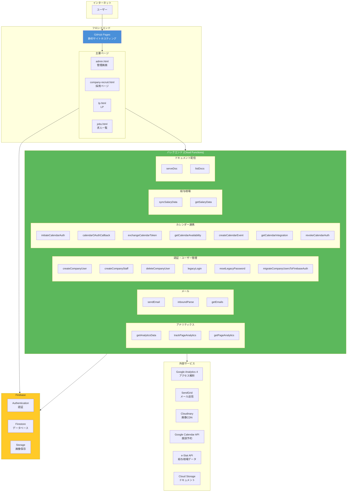
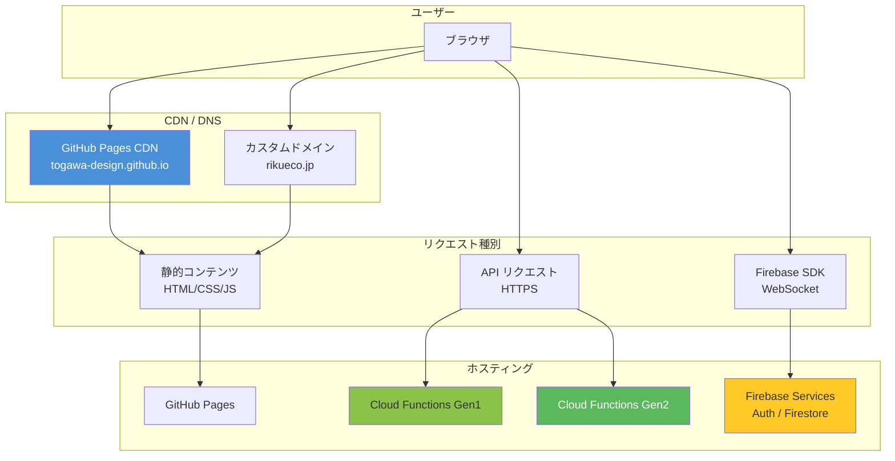

# インフラ構成図

## 概要

本システムはGoogle Cloud Platform（GCP）とFirebaseを基盤とし、GitHub Pagesでフロントエンドをホスティング。

*最終更新: 2026-02-14*

---

## 全体構成図

---

## 環境構成

### 本番環境

| サービス | プロジェクトID / URL |
|---------|---------------------|
| GCP Project | `generated-area-484613-e3` |
| Firebase Project | `generated-area-484613-e3-90bd4` |
| Cloud Functions | `asia-northeast1-generated-area-484613-e3.cloudfunctions.net` |
| GitHub Pages | `https://togawa-design.github.io` |
| カスタムドメイン | `https://rikueco.jp` |
| GA4 Property | `520379160` |

### 開発環境

| サービス | プロジェクトID / URL |
|---------|---------------------|
| GCP Project | `lset-dev` |
| Firebase Project | `lset-dev` |
| Cloud Functions | `asia-northeast1-lset-dev.cloudfunctions.net` |
| GA4 Property | `524526933` |
| ドキュメント | `gs://lset-dev-docs/docs/` |

---

## GCPリソース詳細

### Cloud Functions

#### アナリティクス系

| 関数名 | Gen | 機能 |
|-------|-----|------|
| getAnalyticsData | Gen2 | GA4 Data APIからアナリティクスデータ取得 |
| trackPageAnalytics | Gen2 | ページビュー・イベント記録 |
| getPageAnalytics | Gen2 | 記録したアナリティクスデータ取得 |
| health | Gen2 | ヘルスチェック |

#### メール系

| 関数名 | Gen | 機能 |
|-------|-----|------|
| sendEmail | Gen2 | SendGrid経由でメール送信 |
| inboundParse | Gen2 | 受信メール解析（SendGrid Inbound Parse） |
| getEmails | Gen2 | メール履歴取得 |

#### 認証・ユーザー管理系

| 関数名 | Gen | 機能 |
|-------|-----|------|
| createCompanyUser | Gen2 | 会社管理者ユーザー作成（Firebase Auth連携） |
| createCompanyStaff | Gen2 | 会社スタッフユーザー作成（Firebase Auth連携） |
| deleteCompanyUser | Gen2 | 会社ユーザー削除 |
| migrateCompanyUsersToFirebaseAuth | Gen2 | 既存ユーザーのFirebase Auth移行 |
| legacyLogin | Gen1 | レガシーログイン処理 |
| resetLegacyPassword | Gen1 | パスワードリセット |

#### カレンダー連携系

| 関数名 | Gen | 機能 |
|-------|-----|------|
| initiateCalendarAuth | Gen1 | Google Calendar OAuth認証開始 |
| calendarOAuthCallback | Gen1 | OAuthコールバック処理 |
| exchangeCalendarToken | Gen2 | トークン交換 |
| getCalendarAvailability | Gen1 | 空き時間取得 |
| createCalendarEvent | Gen1 | 面談予定作成 |
| getCalendarIntegration | Gen1 | 連携状態確認 |
| revokeCalendarAuth | Gen1 | 認証取り消し |

#### 給与相場系

| 関数名 | Gen | 機能 |
|-------|-----|------|
| syncSalaryData | Gen2 | e-Stat APIから給与データ同期 |
| getSalaryData | Gen2 | 給与相場データ取得 |

#### ドキュメント配信系（開発環境のみ）

| 関数名 | Gen | 機能 |
|-------|-----|------|
| serveDoc | Gen2 | Cloud StorageからHTMLドキュメント配信 |
| listDocs | Gen2 | ドキュメント一覧取得 |

### Firebase

#### Authentication
- メール/パスワード認証: 有効
- Google認証: 有効

#### Firestore
- リージョン: `asia-northeast1`
- モード: Native
- 詳細: [Firestore DB構成図](./firestore-schema.md)を参照

#### Storage
- バケット: `generated-area-484613-e3-90bd4.appspot.com`
- 用途: 画像アップロード（Cloudinaryへ移行済み）

---

## ネットワーク構成

---

## セキュリティ

### アクセス制御

| レイヤー | 制御方法 |
|---------|---------|
| Cloud Functions | CORS設定、Firebase ID Token検証 |
| Firestore | セキュリティルール |
| Firebase Auth | メール確認、パスワードポリシー |

### 暗号化

| データ | 暗号化方式 |
|--------|----------|
| 通信 | HTTPS/TLS 1.3 |
| Firestore | 保存時暗号化（デフォルト） |
| パスワード | bcrypt（ソルト付きハッシュ） |

---

## 監視・ログ

| 項目 | サービス |
|------|---------|
| アプリケーションログ | Cloud Logging |
| エラー監視 | Cloud Error Reporting |
| パフォーマンス | Cloud Monitoring |
| アナリティクス | Google Analytics 4 |

---

## コスト構造

### 無料枠内で運用可能な項目

- GitHub Pages: 無料
- Firebase Auth: 10,000 MAU まで無料
- Firestore: 1GB ストレージ、50,000 読み取り/日 まで無料
- Cloud Functions: 200万呼び出し/月 まで無料

### 有料サービス

| サービス | 料金体系 |
|---------|---------|
| SendGrid | 従量課金 or プラン |
| Cloudinary | 従量課金 or プラン |
| GA4 | 無料 |

---

## 関連ドキュメント

- [Firestore DB構成図](./firestore-schema.md)
- [管理画面システム構成](./admin-system-architecture.md)
- [詳細設計書](./detailed-design.md)
- [API仕様書](./api-specification.md)
