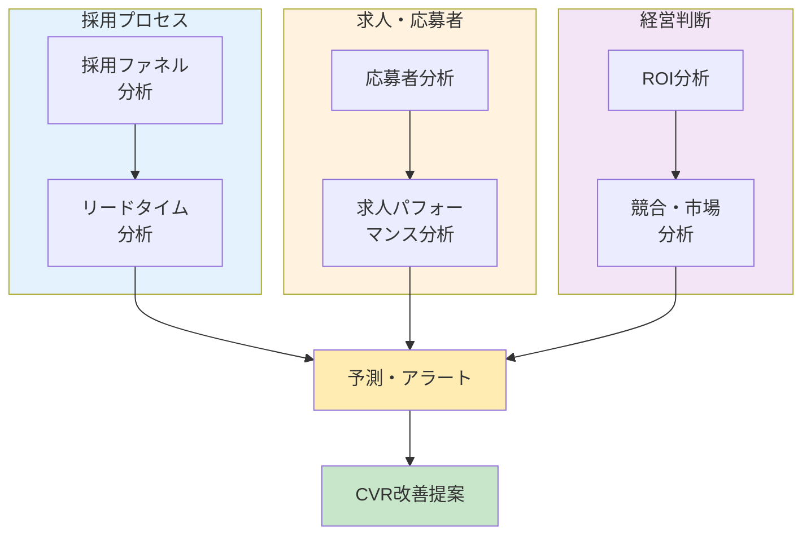

# 分析機能一覧

> 求人サイト・管理画面に実装する分析機能の全体マップ

*最終更新: 2026-02-14*

---

## 実装ステータス一覧

| 機能 | ステータス | 備考 |
|------|:----------:|------|
| 採用ファネル分析 | ✅ 実装済 | 採用管理タブ |
| 応募者分析（基本） | ✅ 実装済 | ステータス分布、担当者割り当て |
| 応募者分析（詳細） | ❌ 未実装 | 年代/地域/時間帯/曜日分析 |
| 求人パフォーマンス分析 | ✅ 実装済 | 企業別タブでPV/応募/CVR比較 |
| リードタイム分析 | ✅ 実装済 | 平均対応時間、担当者別分析 |
| 競合・市場分析 | ❌ 未実装 | 外部データ or 自社データ分析 |
| アラート（対応遅延） | ✅ 実装済 | 48時間/7日の遅延アラート |
| アラート（その他） | ❌ 未実装 | 辞退率/応募数減少/掲載終了 |
| 予測機能 | ❌ 未実装 | 応募数予測、採用達成予測 |
| ROI分析 | ❌ 未実装 | 広告費入力機能が必要 |
| CVR・改善提案 | ❌ 未実装 | 閾値ベースの自動提案 |
| 入社後定着率分析 | ❌ 未実装 | hireDate/resignDate追加が必要 |
| チャネル×定着率分析 | ❌ 未実装 | UTMと定着率のクロス分析 |
| 市場給与相場（e-Stat） | ❌ 未実装 | Cloud Functions定期実行 |

---

## 目次

1. [全体マップ](#全体マップ)
2. [採用ファネル分析](#1-採用ファネル分析)
3. [応募者分析](#2-応募者分析)
4. [求人パフォーマンス分析](#3-求人パフォーマンス分析)
5. [リードタイム分析](#4-リードタイム分析)
6. [競合・市場分析](#5-競合市場分析)
7. [予測・アラート](#6-予測アラート)
8. [ROI分析](#7-roi分析)
9. [CVR・改善提案](#8-cvr改善提案)
10. [実装優先度](#実装優先度)
11. [関連ドキュメント](#関連ドキュメント)

---

## 全体マップ



---

## 1. 採用ファネル分析 ✅ 実装済

**目的**: 採用プロセスのどこで離脱が多いかを可視化

**実装場所**: 詳細分析 → 採用管理タブ

### 可視化イメージ

```
求人閲覧 → 応募 → 連絡済 → 面接 → 内定 → 入社
  100%      5%     4%      3%     1%    0.8%
```

### 分析項目

| 項目 | 説明 | データソース |
|------|------|-------------|
| 各ステップの転換率 | どこで離脱が多いか | applications.status |
| ボトルネック特定 | 「面接→内定」で落ちすぎていないか | 転換率の比較 |
| 求人別比較 | どの求人が採用まで繋がりやすいか | jobId でグループ化 |
| 期間比較 | 先月と今月でファネル改善したか | createdAt でフィルター |

### 詳細設計

→ [recruitment-process-analytics-plan.md](./recruitment-process-analytics-plan.md) 参照

---

## 2. 応募者分析 🔶 一部実装

**目的**: 応募者の傾向を把握し、採用ターゲティングを最適化

### 分析項目

| 項目 | 説明 | 活用方法 | ステータス |
|------|------|---------|:----------:|
| **年代分布** | 10代/20代/30代/40代/50代+ | ターゲット層の確認 | ❌ 未実装 |
| **地域分布** | 都道府県別の応募数 | 広告配信エリアの最適化 | ❌ 未実装 |
| **流入元分布** | Google/Indeed/SNS/直接 | 効果的なチャネル特定 | ✅ 実装済 |
| **時間帯別応募数** | 何時に応募が多いか | 広告配信時間の最適化 | ❌ 未実装 |
| **曜日別応募数** | 何曜日に応募が多いか | 求人更新タイミング | ❌ 未実装 |
| **リピート応募率** | 再応募の割合 | 候補者プール活用 | ❌ 未実装 |

### 可視化イメージ

```
【年代分布】                    【流入元分布】
20代 ████████████████ 45%       Google   ████████████ 35%
30代 ██████████       28%       Indeed   ██████████   30%
40代 ██████           18%       SNS広告  ████████     25%
50代+████             9%        直接     ████         10%

【時間帯別応募数】
     ┌──────────────────────────────────────┐
  50 │                    ●                  │
     │                   ● ●                 │
  40 │              ●   ●   ●               │
     │            ● ● ●     ● ●             │
  30 │          ●           ●   ●           │
     │        ●                   ●         │
  20 │  ●   ●                       ●       │
     │●   ●                           ● ●   │
  10 │                                    ● │
     └──────────────────────────────────────┘
      6  8  10 12 14 16 18 20 22 24 (時)

→ 20時〜22時がピーク → この時間帯に広告強化
```

### 必要データ

```javascript
// applications コレクション
{
  applicantAge: number,           // 年齢（または生年月日から計算）
  applicantAddress: string,       // 住所（都道府県を抽出）
  source: string,                 // 流入元URL
  createdAt: Timestamp            // 応募日時（時間帯・曜日）
}
```

---

## 3. 求人パフォーマンス分析 ✅ 実装済

**目的**: どの求人が効果的かを比較し、求人改善に活かす

**実装場所**: 詳細分析 → 企業別タブ

### 分析項目

| 指標 | 計算式 | 説明 | ステータス |
|------|--------|------|:----------:|
| **閲覧数** | page_analytics の PV | 求人ページの閲覧数 | ✅ 実装済 |
| **応募数** | applications.count | 実際の応募数 | ✅ 実装済 |
| **CVR（応募率）** | 応募数 ÷ 閲覧数 × 100 | 閲覧から応募への転換率 | ✅ 実装済 |
| **採用率** | 採用数 ÷ 応募数 × 100 | 応募から採用への転換率 | ✅ 実装済 |
| **CPA（応募単価）** | 広告費 ÷ 応募数 | 1応募あたりのコスト | ❌ 未実装 |
| **採用単価** | 広告費 ÷ 採用数 | 1採用あたりのコスト | ❌ 未実装 |

### 比較分析

| 比較軸 | 分析内容 |
|--------|---------|
| 給与 vs 応募率 | 給与が高いほど応募が多いか |
| 掲載期間 vs 応募数 | 鮮度が落ちると応募が減るか |
| タイトル A/Bテスト | どのタイトルがクリックされるか |
| 画像有無 vs CVR | 画像があると応募率が上がるか |

### 可視化イメージ

```
┌─────────────────────────────────────────────────────────────────┐
│ 求人パフォーマンス比較                                          │
├─────────────────────────────────────────────────────────────────┤
│                                                                 │
│ 求人タイトル           閲覧数   応募数   CVR    採用数  採用率  │
│ ──────────────────────────────────────────────────────────────  │
│ 製造スタッフ（愛知）    1,250     42    3.4%     12    28.6%   │
│ 物流スタッフ（大阪）      890     28    3.1%      8    28.6%   │
│ 組立作業員（静岡）        650     15    2.3%      3    20.0%   │ ← 要改善
│ 検査スタッフ（愛知）      520     22    4.2%      7    31.8%   │ ← 高CVR
│                                                                 │
│ 【インサイト】                                                  │
│ ・「検査スタッフ」はCVRが高い → 他求人にも検査業務を明記？     │
│ ・「組立作業員」は採用率が低い → 選考基準の見直し？            │
│                                                                 │
└─────────────────────────────────────────────────────────────────┘
```

---

## 4. リードタイム分析 ✅ 実装済

**目的**: 採用プロセスの時間効率を測定し、遅延を特定

**実装場所**: 詳細分析 → 採用管理タブ

### 測定ポイント

| 指標 | 開始 | 終了 | 目標 |
|------|------|------|------|
| 初回レスポンス | 応募 | 初回連絡 | 24時間以内 |
| 面談設定 | 初回連絡 | 面談日確定 | 3日以内 |
| 面談実施 | 面談日確定 | 面談実施 | 7日以内 |
| 選考判断 | 面談実施 | 結果通知 | 3日以内 |
| 総リードタイム | 応募 | 入社 | - |

### 担当者別分析

| 担当者 | 平均レスポンス | 担当数 | 採用率 |
|--------|---------------|--------|--------|
| 田中 | 12時間 ✅ | 35人 | 38% |
| 佐藤 | 36時間 ⚠️ | 28人 | 32% |
| 鈴木 | 48時間 🔴 | 22人 | 28% |

### 詳細設計

→ [recruitment-process-analytics-plan.md](./recruitment-process-analytics-plan.md) 参照

---

## 5. 競合・市場分析 ❌ 未実装

**目的**: 市場動向を把握し、競争力のある求人を作成

**必要なもの**: 外部データ連携 or 自社データの地域/職種分析

### 分析項目

| 項目 | 説明 | データソース |
|------|------|-------------|
| **地域別求人需要** | どのエリアの閲覧が多いか | page_analytics |
| **職種別需要** | どの職種が人気か | 検索キーワード、閲覧数 |
| **給与相場** | 同職種・同地域の平均給与 | 外部データ or 自社データ |
| **掲載企業数** | 競合の求人数 | ※外部データ必要 |

### 可視化イメージ

```
【地域別 閲覧数ヒートマップ】

  北海道: ██ 低
  東北:   ███ 低
  関東:   ████████████ 高
  中部:   ██████████ 高
  関西:   ████████ 中
  中国:   ███ 低
  九州:   █████ 中

→ 関東・中部の需要が高い → この地域の求人を強化
```

### 給与相場比較

```
【製造スタッフ 給与比較】

  業界平均:  月収 28万円
  自社求人:  月収 32万円  ← 競争力あり ✅

【物流スタッフ 給与比較】

  業界平均:  月収 26万円
  自社求人:  月収 24万円  ← 要検討 ⚠️
```

---

## 6. 予測・アラート 🔶 一部実装

**目的**: 問題を早期発見し、先手を打てるようにする

### アラート機能

| レベル | アラート | トリガー条件 | ステータス |
|--------|---------|-------------|:----------:|
| 🔴 緊急 | 対応遅延 | 48時間以上「新規」のまま | ✅ 実装済 |
| 🔴 緊急 | 長期放置 | 7日以上ステータス変更なし | ✅ 実装済 |
| 🟡 警告 | 辞退率上昇 | 先週比で辞退率20%以上増加 | ❌ 未実装 |
| 🟡 警告 | 応募数減少 | 先週比で応募数30%以上減少 | ❌ 未実装 |
| 🟡 警告 | 掲載終了間近 | 掲載終了まで3日以内 | ❌ 未実装 |
| 🔵 情報 | CVR低下傾向 | 2週連続でCVRが下降 | ❌ 未実装 |

### 予測機能

| 機能 | 説明 | 手法 | ステータス |
|------|------|------|:----------:|
| **応募数予測** | 今月の予想応募数 | 過去3ヶ月の移動平均 | ❌ 未実装 |
| **採用達成予測** | 目標達成できそうか | 現在ペース × 残日数 | ❌ 未実装 |
| **異常検知** | 急な変化を検出 | 標準偏差からの乖離 | ❌ 未実装 |

### 可視化イメージ

```
┌─────────────────────────────────────────────────────────────────┐
│ ⚠️ アラート                                          3件       │
├─────────────────────────────────────────────────────────────────┤
│                                                                 │
│ 🔴 対応遅延: 山田太郎さん（製造スタッフ）                        │
│    応募から52時間経過                    [対応する] [詳細]       │
│                                                                 │
│ 🟡 応募数減少: 物流スタッフ（大阪）                              │
│    先週比 -45%                          [求人を確認] [詳細]      │
│                                                                 │
│ 🟡 掲載終了間近: 検査スタッフ（愛知）                            │
│    あと2日で掲載終了                    [延長する] [詳細]        │
│                                                                 │
└─────────────────────────────────────────────────────────────────┘

┌─────────────────────────────────────────────────────────────────┐
│ 📊 今月の予測                                                   │
├─────────────────────────────────────────────────────────────────┤
│                                                                 │
│  応募数予測: 85〜95件（現在: 42件、残り18日）                    │
│  ████████████████░░░░░░░░░░  49% 達成                           │
│                                                                 │
│  採用目標: 10名 → 予測達成率: 80%                               │
│  現在ペースで推移すれば目標達成の見込み ✅                       │
│                                                                 │
└─────────────────────────────────────────────────────────────────┘
```

---

## 7. ROI分析 ❌ 未実装

**目的**: 採用にかかるコストを可視化し、投資対効果を最大化

**必要なもの**: 広告費入力機能（`ad_spend`コレクション）

### 分析項目

| 指標 | 計算式 | 説明 |
|------|--------|------|
| **CPA（応募単価）** | 広告費 ÷ 応募数 | 1応募を獲得するコスト |
| **CPH（採用単価）** | 広告費 ÷ 採用数 | 1人採用するコスト |
| **チャネル別ROI** | 採用数 ÷ 広告費 | どのチャネルが効率的か |
| **求人別ROI** | 採用数 ÷ 掲載コスト | どの求人が費用対効果高いか |

### 可視化イメージ

```
【チャネル別 採用コスト】

チャネル      広告費      応募数    採用数    CPA      CPH
─────────────────────────────────────────────────────────
Google広告   ¥150,000      45        8     ¥3,333   ¥18,750
Indeed       ¥100,000      38        6     ¥2,632   ¥16,667 ← 最も効率的
SNS広告      ¥80,000       20        3     ¥4,000   ¥26,667
─────────────────────────────────────────────────────────
合計         ¥330,000     103       17     ¥3,204   ¥19,412

【インサイト】
・Indeed が最もCPH（採用単価）が低い → 予算配分を増やす
・SNS広告 は採用単価が高い → クリエイティブ見直し or 予算削減
```

### 必要データ

```javascript
// 新規コレクション: ad_spend
{
  companyDomain: string,
  channel: 'google' | 'indeed' | 'sns' | 'other',
  month: '2025-02',
  amount: 150000,       // 広告費（円）
  notes: string
}
```

---

## 8. CVR・改善提案 ❌ 未実装

**目的**: LP・採用ページの改善ポイントを自動で提案

**必要なもの**: 閾値ベースの判定ロジック、提案文言の表示

### 分析項目

| 指標 | 閾値 | 改善提案 |
|------|------|----------|
| CVR | < 1% | CTAボタンの配置・文言の見直し |
| CVR | < 0.5% | ファーストビューにCTA追加を強く推奨 |
| 平均滞在時間 | < 30秒 | コンテンツの魅力度向上が必要 |
| 平均滞在時間 | < 10秒 | ページ読み込み速度を確認 |
| モバイルCVR / PC CVR | < 0.5 | モバイル表示の最適化が必要 |

### 詳細設計

→ [TODO-analytics-insights.md](./TODO-analytics-insights.md) 参照

---

## 実装優先度

### Phase 1: 基本分析（最優先） ✅ 完了

| 機能 | 理由 | ステータス |
|------|------|:----------:|
| 採用ファネル分析 | 既存データで実装可能、効果大 | ✅ 完了 |
| 応募者分析（属性分布） | 既存データで実装可能 | ✅ 基本完了 |
| リードタイム分析 | 対応遅延の可視化は即効性あり | ✅ 完了 |
| アラート（対応遅延） | 問題の早期発見 | ✅ 完了 |

### Phase 2: 詳細分析 🔶 一部実装

| 機能 | 理由 | ステータス |
|------|------|:----------:|
| 求人パフォーマンス比較 | 求人改善に直結 | ✅ 完了 |
| 担当者別分析 | マネジメントに有用 | ✅ 完了 |
| 時間帯・曜日分析 | 広告最適化に有用 | ❌ 未実装 |
| CVR改善提案 | LP改善に直結 | ❌ 未実装 |

### Phase 3: 高度な分析 ❌ 未着手

| 機能 | 理由 | ステータス |
|------|------|:----------:|
| ROI分析 | 広告費データの入力が必要 | ❌ 未実装 |
| 予測機能 | データ蓄積が必要 | ❌ 未実装 |
| 競合・市場分析 | 外部データが必要 | ❌ 未実装 |

### Phase 4: コンサル向け高度分析 ❌ 未着手

求人コンサルティングに活用できる分析機能。

| 機能 | 説明 | 必要なデータ | ステータス |
|------|------|-------------|:----------:|
| **入社後定着率** | 採用品質の評価 | `hireDate`, `resignDate` | ❌ 未実装 |
| **早期離職分析** | ミスマッチの原因特定 | 3ヶ月後フォローアップ | ❌ 未実装 |
| **チャネル×定着率** | 質の高い流入元特定 | UTM × 定着率クロス | ❌ 未実装 |
| **給与帯×応募率** | 適正給与の提案 | jobs.salary × applications | ❌ 未実装 |
| **タイトル効果分析** | 効果的な文言の特定 | タイトル別CTR | ❌ 未実装 |
| **市場給与相場** | 競争力の可視化 | e-Stat API連携 | ❌ 未実装 |

#### 定着率データ収集（要追加フィールド）

```javascript
// applications コレクションに追加
{
  // 既存フィールド...
  hireDate: Timestamp,        // 入社日
  resignDate: Timestamp,      // 退職日（早期離職の場合）
  resignReason: string,       // 退職理由
  retentionStatus: 'active' | 'resigned_early' | 'resigned' | null
}
```

#### コンサルレポート出力イメージ

```
┌─────────────────────────────────────────────────────────────┐
│ 📊 採用コンサルレポート: 株式会社A        2026年2月          │
├─────────────────────────────────────────────────────────────┤
│                                                             │
│ 【採用効率サマリー】                                        │
│  ・応募→採用 転換率: 12% (業界平均: 8%)  ✅                 │
│  ・平均採用リードタイム: 18日                               │
│  ・採用単価: 8.5万円                                        │
│                                                             │
│ 【チャネル別パフォーマンス】                                │
│  Google広告: 応募45件 / 採用3名 / 定着率67%                 │
│  Indeed:     応募28件 / 採用5名 / 定着率100% ← 推奨         │
│  TikTok:     応募22件 / 採用2名 / 定着率50%  ← 要検証       │
│                                                             │
│ 【課題と提案】                                              │
│  1. TikTok経由の早期離職率が高い → ターゲット見直し         │
│  2. 面接→内定の転換率が低い → 面接官トレーニング推奨       │
│  3. 給与が相場より5%低い → 競合対策として給与改定検討       │
│                                                             │
└─────────────────────────────────────────────────────────────┘
```

---

## 関連ドキュメント

| ファイル | 内容 |
|----------|------|
| [recruitment-process-analytics-plan.md](./recruitment-process-analytics-plan.md) | 採用プロセス分析の詳細設計 |
| [TODO-analytics-insights.md](./TODO-analytics-insights.md) | CVR改善提案の詳細設計 |
| [utm-tracking-guide.md](../marketing/utm-tracking-guide.md) | 広告トラッキング設定ガイド |

---

*作成日: 2025-02-12*
*更新日: 2026-02-14*
