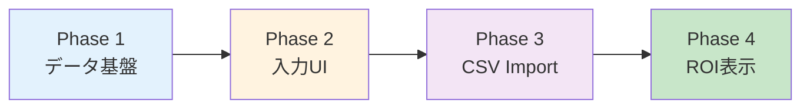

# ROI分析機能 実装計画

**ステータス: ✅ Phase 1〜4 実装完了**

*最終更新: 2026-02-15*

## 概要
広告費用を管理し、UTMトラッキングデータと組み合わせてROI分析を行う機能。
admin が各社の広告費用を代理入力し、会社ユーザーは自社のROIを閲覧できる。

---

## 実装スコープ

### 対応プラットフォーム（優先順）
1. **Google Ads** - 最優先
2. **TikTok Ads** - 優先
3. **X (Twitter) Ads** - 優先
4. Meta Ads - 低優先（後回し）
5. Yahoo! Ads - 将来対応
6. LINE Ads - 将来対応

---

## Phase 1: データ基盤

### 1.1 Firestore コレクション設計

```
ad_costs/
└── {docId}
    ├── companyDomain: string    // 対象会社
    ├── yearMonth: string        // "2026-02"
    ├── channel: string          // "google" | "tiktok" | "x"
    ├── budget: number           // 月間予算（円）
    ├── spend: number            // 実績費用（円）
    ├── impressions: number      // 表示回数（任意）
    ├── clicks: number           // クリック数（任意）
    ├── campaignData: array      // キャンペーン別詳細（任意）
    │   └── { name, spend, clicks }
    ├── createdBy: string        // 入力者ID
    ├── createdAt: timestamp
    └── updatedAt: timestamp
```

### 1.2 Firestore Rules 追加

**修正ファイル:** `firestore.rules`

```javascript
// ===== ad_costs コレクション - 広告費用データ =====
match /ad_costs/{docId} {
  // admin: 全社の読み書き可能
  // 会社ユーザー: 自社のみ読み取り可能
  allow read: if isAuthenticated() && (
    isAdmin() ||
    resource.data.companyDomain == getUserCompanyDomain()
  );
  allow write: if isAuthenticated() && isAdmin();
}
```

---

## Phase 2: Admin 入力UI

### 2.1 新規セクション作成

**新規ファイル:**
- `public/admin/sections/ad-costs.html` - HTML/CSS
- `src/features/admin/ad-costs.js` - ロジック

### 2.2 ナビゲーション追加

**修正ファイル:** `admin.html`

```html
<!-- nav-admin 内に追加 -->
<a href="#" class="nav-item" data-section="ad-costs">
  <span class="nav-icon">💰</span>
  <span>広告費用管理</span>
</a>
```

### 2.3 UI構成

```
┌─────────────────────────────────────────────────────────┐
│ 広告費用管理                                            │
├─────────────────────────────────────────────────────────┤
│                                                         │
│  タブ: [入力] [一覧] [インポート]                        │
│                                                         │
│  === 入力タブ ===                                        │
│  対象会社: [▼ 会社選択        ]                         │
│  対象月:   [▼ 2026年2月       ]                         │
│                                                         │
│  ┌──────────┬────────┬────────┬──────────┐             │
│  │チャネル  │予算    │実績    │操作      │             │
│  ├──────────┼────────┼────────┼──────────┤             │
│  │Google    │¥      │¥      │ [保存]   │             │
│  │TikTok    │¥      │¥      │ [保存]   │             │
│  │X         │¥      │¥      │ [保存]   │             │
│  └──────────┴────────┴────────┴──────────┘             │
│                                                         │
│  === インポートタブ ===                                  │
│  データソース: ○ Google ○ TikTok ○ X ○ カスタム       │
│  [ファイル選択] [プレビュー] [インポート実行]            │
│                                                         │
└─────────────────────────────────────────────────────────┘
```

---

## Phase 3: CSVインポート機能

### 3.1 フォーマット定義

**新規ファイル:** `src/features/admin/csv-import-formats.js`

```javascript
export const IMPORT_FORMATS = {
  google_ads: {
    name: 'Google Ads',
    columns: {
      date: ['日', 'Day', 'Date'],
      campaign: ['キャンペーン', 'Campaign'],
      cost: ['費用', 'Cost'],
      impressions: ['表示回数', 'Impressions', 'Impr.'],
      clicks: ['クリック数', 'Clicks']
    },
    dateFormats: ['YYYY/MM/DD', 'YYYY-MM-DD'],
    encoding: 'UTF-8'
  },
  tiktok_ads: {
    name: 'TikTok Ads',
    columns: {
      date: ['Date', '日付'],
      campaign: ['Campaign name', 'キャンペーン名'],
      cost: ['Cost', '費用'],
      impressions: ['Impressions'],
      clicks: ['Clicks']
    },
    dateFormats: ['YYYY-MM-DD'],
    encoding: 'UTF-8'
  },
  x_ads: {
    name: 'X (Twitter) Ads',
    columns: {
      date: ['日付', 'Date'],
      campaign: ['キャンペーン名', 'Campaign name'],
      cost: ['請求額', 'Spend', 'Amount spent'],
      impressions: ['インプレッション', 'Impressions'],
      clicks: ['クリック数', 'Clicks']
    },
    dateFormats: ['YYYY/MM/DD', 'MM/DD/YYYY'],
    encoding: 'UTF-8'
  },
  custom: {
    name: 'カスタム',
    // ユーザーが列を手動マッピング
  }
};
```

### 3.2 各媒体エクスポートリンク

インポート画面に各プラットフォームのエクスポートページへのリンクを表示

```javascript
export const PLATFORM_EXPORT_URLS = {
  google_ads: {
    name: 'Google Ads',
    exportUrl: 'https://ads.google.com/aw/reporting/reporteditor',
    helpUrl: 'https://support.google.com/google-ads/answer/2454069',
    icon: '🔵',
    note: 'レポート → カスタムレポート → CSVダウンロード'
  },
  tiktok_ads: {
    name: 'TikTok Ads',
    exportUrl: 'https://ads.tiktok.com/i18n/dashboard',
    helpUrl: 'https://ads.tiktok.com/help/article/export-data',
    icon: '🎵',
    note: 'レポート → エクスポート → CSV'
  },
  x_ads: {
    name: 'X (Twitter) Ads',
    exportUrl: 'https://ads.twitter.com/analytics',
    helpUrl: 'https://business.twitter.com/ja/help/campaign-analytics.html',
    icon: '✖️',
    note: 'アナリティクス → データをエクスポート'
  }
};
```

**UI表示例:**
```
┌─────────────────────────────────────────────────────────┐
│ CSVインポート                                           │
├─────────────────────────────────────────────────────────┤
│                                                         │
│  📥 各媒体からデータをエクスポートしてください          │
│                                                         │
│  🔵 Google Ads                                          │
│     [管理画面を開く↗]  レポート → CSVダウンロード       │
│                                                         │
│  🎵 TikTok Ads                                          │
│     [管理画面を開く↗]  レポート → エクスポート          │
│                                                         │
│  ✖️ X (Twitter) Ads                                     │
│     [管理画面を開く↗]  アナリティクス → エクスポート    │
│                                                         │
│  ─────────────────────────────────────────────────────  │
│  データソース: [▼ Google Ads     ]                      │
│  [ファイルを選択]                                       │
│                                                         │
└─────────────────────────────────────────────────────────┘
```

### 3.3 インポート処理

**新規ファイル:** `src/features/admin/csv-importer.js`

```javascript
// CSV読み込み → パース → プレビュー → Firestore保存
export async function importAdCostCSV(file, format, companyDomain) {
  // 1. ファイル読み込み
  // 2. フォーマットに基づいて列マッピング
  // 3. データ変換（日付、金額）
  // 4. 月別に集計
  // 5. Firestoreに保存
}
```

---

## Phase 4: ROI分析ダッシュボード

### 4.1 会社ユーザー向け表示

**修正ファイル:** `src/features/admin/analytics.js` または新規セクション

既存の「詳細分析」に ROI タブを追加、または新規セクション作成

### 4.2 表示内容

```
┌─────────────────────────────────────────────────────────┐
│ 広告ROI分析                         2026年2月 ▼        │
├─────────────────────────────────────────────────────────┤
│                                                         │
│  ┌─────────┐ ┌─────────┐ ┌─────────┐ ┌─────────┐      │
│  │ 総予算  │ │ 消化額  │ │ 応募数  │ │ CPA     │      │
│  │ ¥700万  │ │ ¥440万  │ │ 60件    │ │ ¥7.3万  │      │
│  └─────────┘ └─────────┘ └─────────┘ └─────────┘      │
│                                                         │
│  チャネル別パフォーマンス                               │
│  ┌──────────┬────────┬──────┬──────┬─────┬──────┐     │
│  │チャネル  │予算    │消化  │応募数│CPA  │判定  │     │
│  ├──────────┼────────┼──────┼──────┼─────┼──────┤     │
│  │Google    │¥300万  │¥200万│ 45件 │¥4.4万│ ✅   │     │
│  │TikTok    │¥250万  │¥180万│ 12件 │¥15万 │ ⚠️   │     │
│  │X         │¥150万  │¥60万 │  3件 │¥20万 │ ❌   │     │
│  └──────────┴────────┴──────┴──────┴─────┴──────┘     │
│                                                         │
│  💡 推奨アクション                                      │
│  ├─ Google: CPA良好。追加予算を検討                    │
│  ├─ TikTok: 採用単価が高め。クリエイティブ改善を推奨  │
│  └─ X: パフォーマンス低迷。一時停止を検討              │
│                                                         │
└─────────────────────────────────────────────────────────┘
```

### 4.3 UTMデータとの紐付け

**修正ファイル:** `src/shared/activity-tracker.js` または新規

```javascript
// UTM source から channel への変換
const UTM_TO_CHANNEL = {
  'google': 'google',
  'google_ads': 'google',
  'tiktok': 'tiktok',
  'tiktok_ads': 'tiktok',
  'twitter': 'x',
  'x': 'x',
  // ...
};

// 応募データからチャネル別応募数を集計
export async function getApplicationsByChannel(companyDomain, yearMonth) {
  // applications コレクションから utm_source を集計
}
```

---

## 実装されたファイル一覧

### 新規作成

| ファイル | 説明 | ステータス |
|---------|------|----------|
| `public/admin/sections/ad-costs.html` | 広告費用管理UI（HTML/CSS） | ✅ |
| `src/features/admin/ad-costs.js` | 広告費用管理ロジック（入力/一覧/レポート/インポート） | ✅ |

### 修正

| ファイル | 修正内容 | ステータス |
|---------|---------|----------|
| `firestore.rules` | ad_costs コレクションのルール追加 | ✅ |
| `admin.html` | ナビゲーションに「広告費用管理」追加 | ✅ |
| `src/features/admin/index.js` | ad-costs モジュールの読み込み | ✅ |

### 実装詳細

**ad-costs.js の機能:**
- 4タブ構成（入力/一覧/レポート/インポート）
- チャンネル定義（Google/TikTok/X/Meta/Yahoo/LINE）
- UTMソースとチャンネルの自動マッピング
- CPA計算・レポート生成
- CSV自動解析（日付列・費用列の自動検出）
- 月別データ集計・Firestore保存

---

## 実装順序



### 詳細ステップ

1. **Phase 1: データ基盤** ✅
   - [x] Firestore rules 更新
   - [x] rules デプロイ（dev/prod両環境）

2. **Phase 2: Admin入力UI** ✅
   - [x] ad-costs.html 作成
   - [x] ad-costs.js 作成
   - [x] ナビゲーション追加
   - [x] 手動入力機能実装
   - [x] 動作確認

3. **Phase 3: CSVインポート** ✅
   - [x] フォーマット定義作成（Google/TikTok/X対応）
   - [x] CSVパーサー実装
   - [x] プレビュー機能
   - [x] インポート実行機能
   - [x] 各プラットフォームエクスポートリンク

4. **Phase 4: ROI表示** ✅
   - [x] UTM紐付けロジック
   - [x] CPA計算ロジック
   - [x] レポートダッシュボードUI
   - [x] 推奨アクション生成

---

## 技術メモ

### CSV文字コード対応
- Google Ads: UTF-8 / Shift_JIS
- TikTok: UTF-8
- X: UTF-8

```javascript
// 文字コード自動判定
import { detect } from 'jschardet';
import iconv from 'iconv-lite';
```

### 金額パース
- カンマ区切り対応: `¥1,234,567` → `1234567`
- 通貨記号除去: `$` `¥` `￥`

---

*作成日: 2026-02-15*
