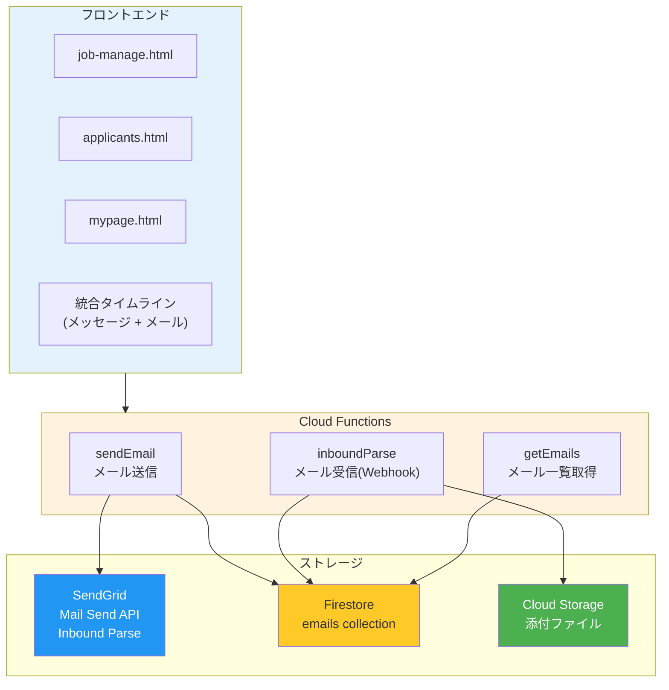

# メール送受信システム実装計画

## 概要
SendGridを使用して、企業と応募者間のメール送受信をシステム内で完結させる機能を実装する。

## アーキテクチャ



---

## Phase 1: メール送信機能（基盤）

### 1.1 Cloud Functions - sendEmail
**ファイル:** `functions/index.js`

```javascript
// 追加するエンドポイント
exports.sendEmail = functions.https.onRequest(async (req, res) => {
  // 1. 認証チェック（Firebase Auth）
  // 2. companyDomain で権限確認
  // 3. SendGrid API でメール送信
  // 4. Firestore emails コレクションに保存
});
```

### 1.2 Firestore - emails コレクション
```javascript
{
  companyDomain: string,        // 企業識別（セキュリティ用）
  applicationId: string,        // 応募データへの紐付け
  direction: "outbound" | "inbound",
  from: { email, name },
  to: { email, name },
  replyTo: string,              // 返信用アドレス（トークン付き）
  subject: string,
  bodyText: string,
  bodyHtml: string,
  status: "sent" | "delivered" | "failed" | "received",
  readByCompany: boolean,
  createdAt: timestamp,
  sentAt: timestamp
}
```

### 1.3 依存パッケージ追加
**ファイル:** `functions/package.json`
```json
{
  "dependencies": {
    "@sendgrid/mail": "^8.0.0",
    "busboy": "^1.6.0"
  }
}
```

---

## Phase 2: メール受信機能

### 2.1 SendGrid Inbound Parse 設定
1. ドメインのMXレコード設定（例: `parse.yourdomain.com`）
2. SendGrid Dashboard で Webhook URL を設定
3. Cloud Functions `inboundParse` エンドポイント作成

### 2.2 Reply-To トークン機構
- 送信時: `reply-{暗号化トークン}@parse.yourdomain.com` を生成
- 受信時: トークンから `applicationId` と `companyDomain` を復元
- 暗号化: AES-256-GCM で安全に

### 2.3 Cloud Functions - inboundParse
**ファイル:** `functions/index.js`
```javascript
exports.inboundParse = functions.https.onRequest(async (req, res) => {
  // 1. multipart/form-data をパース（busboy使用）
  // 2. Reply-To からトークン抽出・復号
  // 3. Firestore emails コレクションに保存
  // 4. 添付ファイルは Cloud Storage へ
});
```

---

## Phase 3: フロントエンド統合

### 3.1 統合タイムラインUI
**ファイル:** `src/features/applicants/index.js`

既存の `messages-container` を拡張し、メッセージとメールを時系列で統合表示：

```html
<div class="communication-timeline">
  <!-- メッセージ（アプリ内）-->
  <div class="timeline-item message">...</div>

  <!-- メール（送信）-->
  <div class="timeline-item email outbound">
    <span class="badge">メール送信</span>
    ...
  </div>

  <!-- メール（受信）-->
  <div class="timeline-item email inbound">
    <span class="badge">メール受信</span>
    ...
  </div>
</div>
```

### 3.2 メール作成モーダル
- テンプレート選択
- 件名・本文入力
- プレビュー機能
- 送信ボタン

### 3.3 マイページ側（応募者向け）
**ファイル:** `src/features/mypage/index.js`

メールも統合タイムラインに表示（読み取り専用）

---

## Phase 4: セキュリティ

### 4.1 Firestore ルール
**ファイル:** `firestore.rules`
```javascript
match /emails/{emailId} {
  // 企業ユーザーは自社のメールのみ
  allow read: if request.auth != null
    && get(/databases/$(database)/documents/company_users/$(request.auth.uid))
       .data.companyDomain == resource.data.companyDomain;

  // 書き込みはCloud Functionsのみ
  allow write: if false;
}
```

### 4.2 インデックス追加
**ファイル:** `firestore.indexes.json`
```json
{
  "collectionGroup": "emails",
  "fields": [
    { "fieldPath": "companyDomain", "order": "ASCENDING" },
    { "fieldPath": "createdAt", "order": "DESCENDING" }
  ]
}
```

---

## 修正対象ファイル

| ファイル | 変更内容 |
|---------|---------|
| `functions/index.js` | sendEmail, inboundParse, getEmails 追加 |
| `functions/package.json` | @sendgrid/mail, busboy 追加 |
| `src/features/applicants/index.js` | 統合タイムライン、メール送信UI |
| `src/features/mypage/index.js` | メール表示追加 |
| `firestore.rules` | emails コレクションのルール |
| `firestore.indexes.json` | emails 用インデックス |

---

## SendGrid 設定手順（実装時に実施）

### 1. API Key 作成
- SendGrid Dashboard → Settings → API Keys
- 「Create API Key」→ Full Access で作成
- キーを安全に保存（一度しか表示されない）

### 2. 送信ドメイン認証（お名前.com）

**SendGrid側:**
1. Settings → Sender Authentication → Authenticate Your Domain
2. DNS Host: 「Other」を選択
3. ドメイン名を入力 → CNAMEレコード3つが生成される

**お名前.com側:**
1. [お名前.com Navi](https://navi.onamae.com/) にログイン
2. ドメイン → DNS設定 → DNSレコード設定

追加するCNAMEレコード（例）:
| ホスト名 | TYPE | VALUE |
|---------|------|-------|
| `em1234` | CNAME | `u12345678.wl.sendgrid.net` |
| `s1._domainkey` | CNAME | `s1.domainkey.u12345678.wl.sendgrid.net` |
| `s2._domainkey` | CNAME | `s2.domainkey.u12345678.wl.sendgrid.net` |

### 3. Inbound Parse設定（メール受信用）

**お名前.com側 - MXレコード追加:**
| ホスト名 | TYPE | VALUE | 優先度 |
|---------|------|-------|--------|
| `parse` | MX | `mx.sendgrid.net` | 10 |

**SendGrid側:**
1. Settings → Inbound Parse → Add Host & URL
2. Receiving Domain: `parse.yourcompany.com`
3. Destination URL: `https://asia-northeast1-{PROJECT_ID}.cloudfunctions.net/inboundParse`

### 推奨プラン
- **開発時**: Free（100通/日）
- **本番運用**: Essentials（$19.95/月）またはPro（$89.95/月・専用IP付き）

---

## 検証方法

1. **送信テスト**
   - 管理画面からメール作成・送信
   - 応募者のメールアドレスに届くことを確認
   - Firestore に保存されることを確認

2. **受信テスト**
   - 応募者から返信メールを送信
   - Cloud Functions のログで受信確認
   - Firestore に保存されることを確認
   - 管理画面に表示されることを確認

3. **セキュリティテスト**
   - 他社のメールが見えないことを確認
   - 認証なしでAPIアクセスできないことを確認
