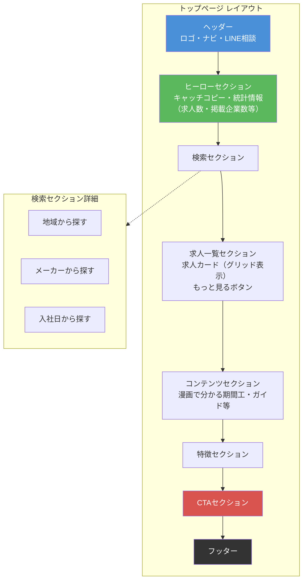
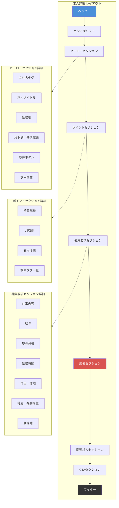
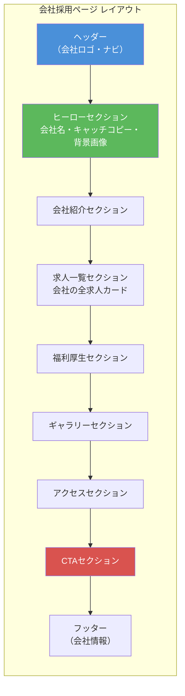
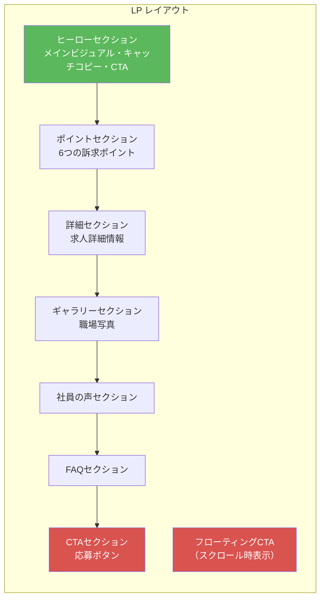
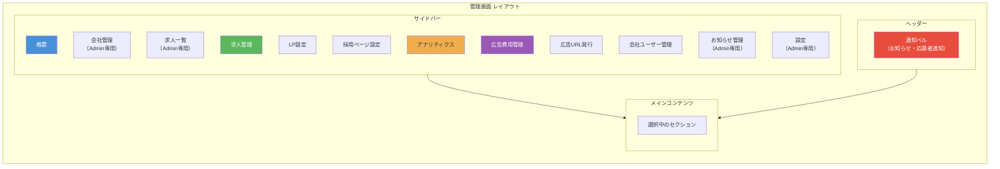
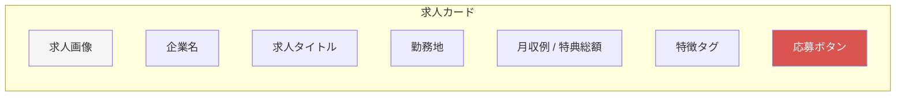

# リクエコ求人ナビ 画面設計書

## 概要

期間工・期間従業員専門の求人情報サイト。求職者向けのフロントエンド画面と、企業向けの管理画面で構成。

*最終更新: 2026-02-15*

---

## 目次

### 画面
- [画面一覧](#画面一覧)
  - [公開画面（求職者向け）](#1-公開画面求職者向け)
  - [管理画面（企業・運営者向け）](#2-管理画面企業運営者向け)

### 画面詳細
- [P-001: トップページ](#p-001-トップページ-indexhtml) / [P-003: 求人詳細](#p-003-求人詳細-job-detailhtml)
- [P-005: 会社採用ページ](#p-005-会社採用ページ-company-recruithtml) / [P-007: LP](#p-007-lp-lphtml)
- [A-001: 管理ダッシュボード](#a-001-管理ダッシュボード-adminhtml) - セクション構成・権限

### コンポーネント・技術仕様
- [共通コンポーネント](#共通コンポーネント) - ヘッダー・フッター・カード・モーダル
- [レスポンシブ対応](#レスポンシブ対応) - ブレークポイント・レイアウト変更
- [認証・権限](#認証権限) - Firebase Auth・権限レベル
- [外部連携](#外部連携) - Firebase・Cloud Functions・外部サービス

---

## 画面一覧

### 1. 公開画面（求職者向け）

| 画面ID | 画面名 | ファイル | URL | 概要 |
|--------|--------|----------|-----|------|
| P-001 | トップページ | index.html | / | 求人検索・一覧表示 |
| P-002 | 求人一覧 | jobs.html | /jobs.html | 全求人の一覧・絞り込み |
| P-003 | 求人詳細 | job-detail.html | /job-detail.html?company={id}&job={id} | 求人の詳細情報・応募フォーム |
| P-004 | 会社一覧 | company.html | /company.html | 掲載会社の一覧 |
| P-005 | 会社採用ページ | company-recruit.html | /company-recruit.html?id={domain} | 会社の採用情報ページ |
| P-006 | 地域検索 | location.html | /location.html?prefecture={pref} | 地域別求人検索 |
| P-007 | LP（ランディングページ） | lp.html | /lp.html?j={domain_jobId} | 求人専用LP |
| P-008 | マイページ | mypage.html | /mypage.html | お気に入り・応募履歴 |

### 2. 管理画面（企業・運営者向け）

| 画面ID | 画面名 | ファイル | URL | 概要 |
|--------|--------|----------|-----|------|
| A-001 | 管理ダッシュボード | admin.html | /admin.html | 統合管理画面（SPA） |
| A-002 | 応募者管理 | applicants.html | /applicants.html | 応募者一覧・ステータス管理（スタンドアロン） |

---

## 画面詳細

### P-001: トップページ (index.html)

**目的**: サイトの入口。求人検索と主要求人の表示

**レイアウト構成**:

**主要コンポーネント**:
- 求人カード: 企業名・職種・勤務地・月収例・特典総額・タグ
- 検索カード: アイコン・タイトル・説明
- 統計カード: 数値・ラベル

**データソース**:
- Firebase Firestore（companies, jobs コレクション）

---

### P-003: 求人詳細 (job-detail.html)

**目的**: 求人の詳細情報表示と応募受付

**レイアウト構成**:

**モーダル**:
- 応募フォームモーダル
  - 基本情報: 氏名・電話番号・メールアドレス
  - 詳細情報: 年齢・希望勤務開始日・現住所
  - カスタム質問項目（企業ごとに設定可能）
  - プライバシーポリシー同意
  - 完了画面

**データソース**:
- URLパラメータ: company, job
- Firebase Firestore（求人データ）
- Firebase Firestore（応募データ保存）

---

### P-005: 会社採用ページ (company-recruit.html)

**目的**: 会社の採用情報を一覧表示

**レイアウト構成**:

**データソース**:
- URLパラメータ: id（会社ドメイン）
- Firebase Firestore（companies/{domain}/recruitSettings）

---

### P-007: LP (lp.html)

**目的**: 求人専用のランディングページ（広告用）

**レイアウト構成**:

**セクション表示設定**:
- 各セクションの表示/非表示切り替え可能
- セクション順序のカスタマイズ可能
- デザインパターン選択（shinrai/athome/cute/modan/kenchiku）

**データソース**:
- URLパラメータ: j（{domain}_{jobId}）
- Firebase Firestore（companies/{domain}/lpSettings/{jobId}）

---

### A-001: 管理ダッシュボード (admin.html)

**目的**: 統合管理画面（SPA構成）

**アクセス制御**: Firebase Authentication（Google OAuth / Email認証）

**レイアウト構成**:

**セクション詳細**:

| セクション | Admin | 会社ユーザー | 機能 |
|-----------|:-----:|:-----------:|------|
| 概要 | ○ | ○ | PV/UV/応募数サマリー、グラフ |
| 会社管理 | ○ | × | 会社CRUD、求人管理への遷移 |
| 求人一覧 | ○ | × | 全社横断の求人一覧、フィルタ |
| 求人管理 | ○ | ○ | 求人CRUD、分析、応募者管理 |
| LP設定 | ○ | ○ | セクション編集、プレビュー |
| 採用ページ設定 | ○ | ○ | セクション編集、プレビュー |
| アナリティクス | ○ | △ | 詳細分析（会社ユーザーは自社のみ） |
| 広告費用管理 | ○ | △ | 広告費用入力・一覧・ROIレポート・CSVインポート |
| 広告URL発行 | ○ | ○ | UTMパラメーター付きURL生成・コピー |
| 会社ユーザー管理 | ○ | ○ | ユーザー追加/編集/削除 |
| お知らせ管理 | ○ | × | お知らせ作成・編集・公開期間設定 |
| 設定 | ○ | × | システム設定、管理者管理 |

**通知機能**:
| 通知タイプ | Admin | 会社ユーザー | 内容 |
|-----------|:-----:|:-----------:|------|
| お知らせ | ○ | ○ | 運営からのお知らせ（ベルアイコン） |
| 応募者通知 | ○（全社） | ○（自社） | 新規応募のリアルタイム通知 |

---

## 共通コンポーネント

### ヘッダー
- ロゴ（トップへのリンク）
- ナビゲーション（PC: 横並び / SP: ハンバーガーメニュー）
- LINE相談ボタン
- ログインボタン（未ログイン時）/ マイページリンク（ログイン時）

### フッター
- ナビゲーションリンク
- 電話番号
- コピーライト

### 求人カード

### モーダル
- オーバーレイ背景
- 閉じるボタン
- コンテンツエリア
- アクションボタン

### ローディング
- スピナー
- スケルトンUI

---

## レスポンシブ対応

### ブレークポイント
- PC: 768px以上
- SP: 767px以下

### 主な変更点
| 要素 | PC | SP |
|------|----|----|
| ナビゲーション | 横並び | ハンバーガーメニュー |
| 求人カード | 3-4列グリッド | 1-2列グリッド |
| サイドバー | 固定表示 | 非表示/トグル |
| テーブル | 横スクロール | カード形式 |
| フォント | 基準サイズ | やや小さめ |

---

## 認証・権限

### 認証方式
- Firebase Authentication
- メール/パスワード認証
- Googleアカウント認証（Admin用）

### 権限レベル
| レベル | 説明 | アクセス可能画面 |
|--------|------|------------------|
| 一般ユーザー | 求職者 | 公開画面・マイページ |
| 会社ユーザー (company_user) | 一般スタッフ | 管理画面（自社データのみ・制限あり） |
| 会社管理者 (company_admin) | 担当企業の管理 | 管理画面（自社データのみ） |
| システム管理者 (admin) | 全企業の管理 | 全画面 |

---

## 外部連携

### Firebase
- **Authentication**: ユーザー認証（Google OAuth / Email）
- **Firestore**: 全データ保存（会社・求人・応募・ユーザー等）
- **Storage**: 画像保存（Cloudinaryへ移行済み）

### Cloud Functions
- **アナリティクス**: GA4 Data API連携
- **メール**: SendGrid連携
- **カレンダー**: Google Calendar API連携
- **給与相場**: e-Stat API連携

### 外部サービス
| サービス | 用途 |
|---------|------|
| Google Analytics 4 | アクセス解析 |
| Cloudinary | 画像CDN |
| SendGrid | メール送信 |
| LINE | 公式アカウント誘導 |

---

## 関連ドキュメント

- [画面遷移図](./screen-flow.md)
- [機能一覧](./feature-list.md)
- [分析・解析内容まとめ](./analytics-summary.md)
- [Firestore DB構成図](../system/firestore-schema.md)
- [詳細設計書](../system/detailed-design.md)
