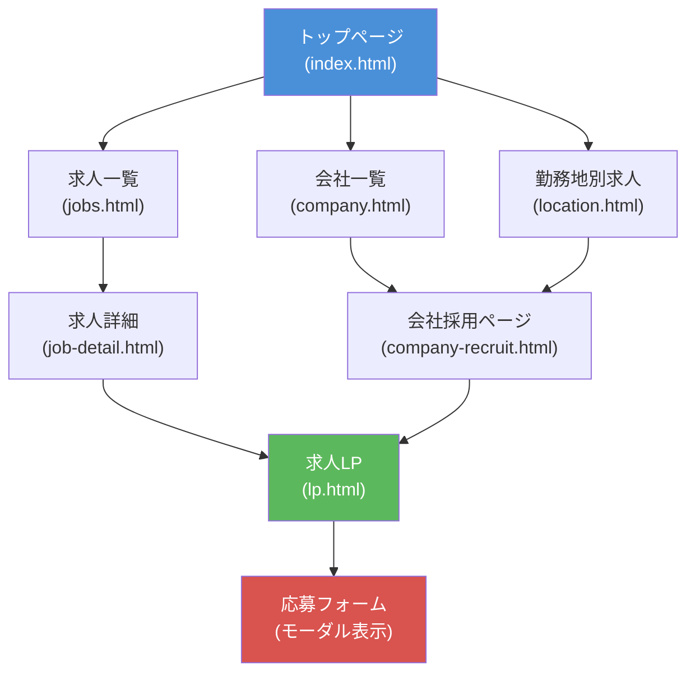
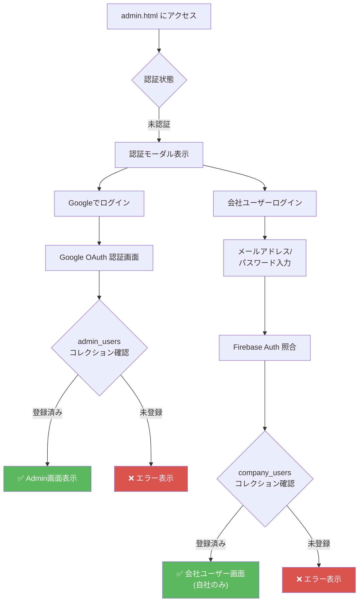
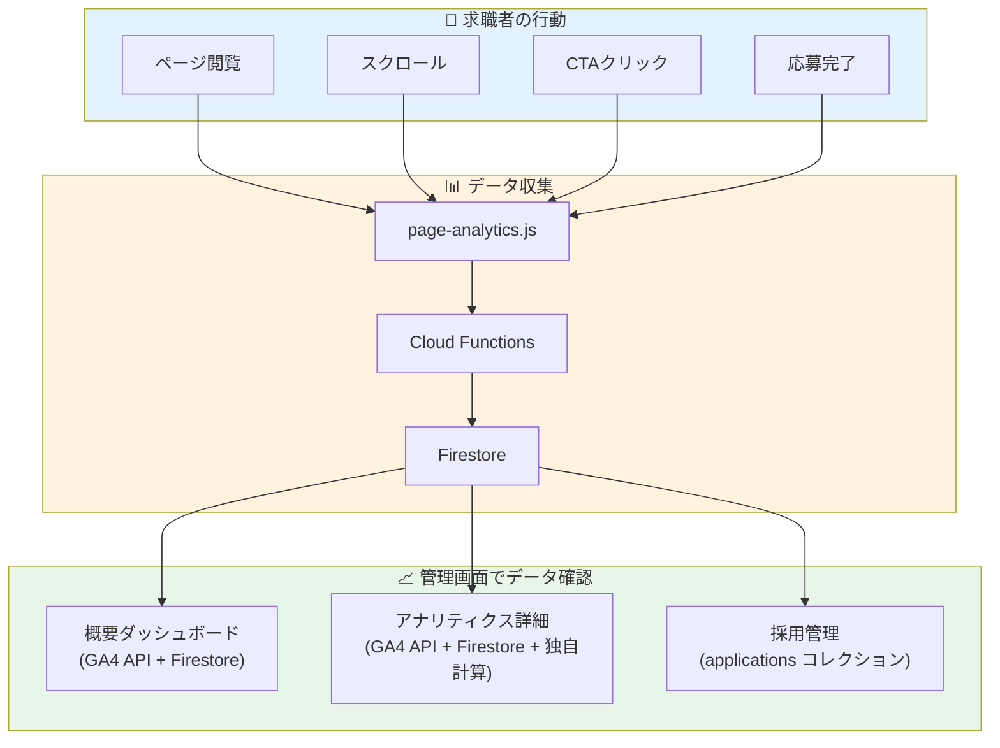

# 画面遷移図

## 概要
本ドキュメントはリクエコの画面遷移を記述します。

*最終更新: 2026-02-12*

---

## 画面一覧

### 公開ページ（求職者向け）

| ファイル名 | 画面名 | 概要 |
|-----------|--------|------|
| index.html | トップページ | サイトのメインページ、注目求人・会社一覧表示 |
| jobs.html | 求人一覧 | 全求人の検索・一覧表示 |
| job-detail.html | 求人詳細 | 個別求人の詳細情報 |
| location.html | 勤務地別求人 | 都道府県別の求人一覧 |
| company.html | 会社一覧 | 掲載会社の一覧 |
| company-recruit.html | 会社採用ページ | 各会社の採用情報ページ |
| lp.html | 求人LP | 個別求人のランディングページ |
| mypage.html | マイページ | ユーザーのお気に入り・応募履歴 |

### ガイドページ

| ファイル名 | 画面名 |
|-----------|--------|
| guide-job-search.html | 仕事探しガイド |
| guide-interview.html | 面接ガイド |
| guide-work.html | 働き方ガイド |
| guide-site.html | サイト利用ガイド |
| about.html | 会社概要 |

### 法的ページ

| ファイル名 | 画面名 |
|-----------|--------|
| legal.html | 特定商取引法に基づく表記 |
| privacy.html | プライバシーポリシー |
| terms.html | 利用規約 |

### 管理画面（認証必要）

| ファイル名 | 画面名 | 概要 |
|-----------|--------|------|
| admin.html | 管理画面（統合SPA） | 会社管理・求人管理・アナリティクスの統合管理画面 |
| applicants.html | 応募者管理（スタンドアロン） | 応募者一覧・管理 |

---

## 画面遷移図

### 公開ページの遷移



---

## 管理画面構成

### ユーザーロール別アクセス権

| セクション | Admin | 会社ユーザー | 備考 |
|-----------|:-----:|:-----------:|------|
| 概要 | ○ | ○ | 会社ユーザーは自社データのみ |
| 会社管理 | ○ | × | |
| 求人一覧（全社） | ○ | × | |
| 求人管理 | ○ | ○ | 会社ユーザーは自社のみ |
| LP設定 | ○ | ○ | 会社ユーザーは自社のみ |
| 採用ページ設定 | ○ | ○ | 会社ユーザーは自社のみ |
| アナリティクス詳細 | ○ | △ | 会社ユーザーは制限あり |
| 会社ユーザー管理 | ○ | ○ | 会社ユーザーは自社のみ |
| 設定 | ○ | × | |

### 管理画面セクション詳細

```
admin.html (SPA - シングルページアプリケーション)
    │
    ├── overview.html ─────────────── 概要・ダッシュボード
    │       ├── PV/UVサマリー
    │       ├── 応募数サマリー
    │       ├── 日別推移グラフ
    │       └── 人口統計（性別・年齢）
    │
    ├── company-manage.html ───────── 会社一覧管理【Admin専用】
    │       ├── 会社検索・フィルター
    │       ├── 会社追加・編集・削除
    │       └─► company-detail.html ── 会社詳細
    │               └─► company-users.html ── 会社ユーザー管理
    │
    ├── job-listings.html ─────────── 求人一覧（全社）【Admin専用】
    │       ├── 全社横断検索
    │       └── 会社別フィルター
    │
    ├── job-manage.html ───────────── 求人管理
    │       ├── [求人] タブ ─── 求人一覧・追加・編集・削除
    │       ├── [分析] タブ ─── 求人別PV・応募数
    │       ├── [レポート] タブ ─ 週次・月次レポート
    │       ├── [応募者] タブ ─── 応募者一覧・ステータス管理
    │       └── [採用ページ] タブ ─ 会社採用ページへのリンク
    │
    ├── lp-settings.html ──────────── LP設定
    │       ├── デザインパターン選択
    │       ├── 6つの訴求ポイント設定
    │       ├── 広告ピクセル設定（TikTok/Google/Meta/LINE/Clarity）
    │       └── プレビュー
    │
    ├── recruit-settings.html ─────── 採用ページ設定
    │       ├── 基本情報設定
    │       ├── カスタムセクション（ドラッグ&ドロップ）
    │       ├── SNS連携設定
    │       └── プレビュー
    │
    ├── analytics-detail.html ─────── アナリティクス詳細
    │       ├── [採用管理] タブ ────【Admin専用】
    │       │       ├── 対応アラート（48時間以上未対応）
    │       │       ├── 採用ファネル（応募→連絡済→面接→内定→入社）
    │       │       ├── リードタイム統計
    │       │       ├── リードタイム分布グラフ
    │       │       ├── 担当者別パフォーマンス
    │       │       └── 企業別ドリルダウン
    │       ├── [企業別] タブ ─────【Admin専用】
    │       │       └── 企業ランキング（PV/応募数）
    │       ├── [LP/採用ページ] タブ
    │       │       ├── ページ別PV/UV/CTA
    │       │       ├── 流入元分析（10種類）
    │       │       ├── デバイス別割合
    │       │       └── LP vs 採用ページ比較
    │       ├── [コンバージョン] タブ
    │       │       ├── CVR分析
    │       │       └── 応募ファネル
    │       ├── [トラフィック] タブ
    │       │       └── 流入元詳細分析
    │       └── [トレンド] タブ
    │               └── 日別/週別/月別推移
    │
    ├── company-users.html ────────── 会社ユーザー管理
    │       ├── ユーザー一覧
    │       ├── ユーザー追加（個別/一括）
    │       ├── ロール設定（管理者/スタッフ）
    │       └── パスワードリセット
    │
    └── settings.html ─────────────── 設定【Admin専用】
            ├── 管理者アカウント管理
            ├── フィードダウンロード
            └── システム設定
```

---

## 認証フロー

### Admin認証（Firebase Authentication + Google OAuth）



### 会社ユーザーの画面制限

```
会社ユーザーログイン後:
    │
    ├── サイドバー: 会社管理・求人一覧・設定 が非表示
    ├── 概要: 自社データのみ表示
    ├── 求人管理: 自社求人のみ
    ├── LP設定: 自社LPのみ
    ├── 採用ページ設定: 自社のみ
    └── アナリティクス:
            ├── 採用管理タブ → 非表示
            ├── 企業別タブ → 非表示
            └── その他タブ → 自社データのみ
```

---

## URLパラメータ

### 求人関連

| ページ | パラメータ | 例 |
|--------|-----------|-----|
| job-detail.html | company, job | `?company=example&job=job001` |
| lp.html | j | `?j=example_job001` |
| company-recruit.html | id | `?id=example` |
| location.html | prefecture | `?prefecture=東京都` |

### 管理画面

| ページ | パラメータ | 例 |
|--------|-----------|-----|
| admin.html | section | `?section=job-manage` |
| admin.html | section, company | `?section=job-manage&company=example` |
| admin.html | section, job | `?section=lp-settings&job=example_job001` |

### UTMパラメータ（トラッキング用）

| パラメータ | 用途 | 例 |
|-----------|------|-----|
| utm_source | 流入元 | `google`, `indeed`, `line` |
| utm_medium | メディア種別 | `cpc`, `organic`, `referral` |
| utm_campaign | キャンペーン名 | `spring_campaign` |
| utm_content | コンテンツ識別 | `banner_a` |
| utm_term | キーワード | `東京 求人` |

---

## データフロー概要



---

## 関連ドキュメント
- [機能一覧](./feature-list.md)
- [分析・解析内容まとめ](./analytics-summary.md)
- [環境構築手順](../development/setup.md)
- [詳細設計書](../system/detailed-design.md)
- [Firestore DB構成図](../system/firestore-schema.md)
